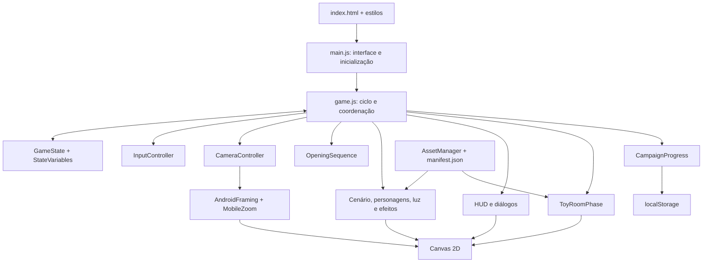

# O Quarto dos Brinquedos

Uma aventura 2D de plataforma e exploração, feita para jogar no navegador. Uma menina acorda em um quarto cheio de brinquedos e, acompanhada por uma fadinha, precisa encontrar o caminho entre objetos que se transformam em apoios para os seus saltos.

A experiência combina abertura narrativa, diálogos, plataformas ilustradas, iluminação de um quarto escuro e uma sala de brinquedos explorável. O projeto utiliza **JavaScript com módulos ES, HTML e Canvas 2D**, sem uma engine externa. O servidor Node.js atende o desenvolvimento local; a jogabilidade roda no navegador.

## A experiência

- **Quarto escuro:** percurso de plataforma com 22 apoios, cena do castelo e progressão dos saltos durante a fuga.
- **Percurso de retorno:** 16 apoios, deslocamento na direção oposta e passagem pelo portal final.
- **Sala de brinquedos:** exploração com visão superior, coleta de oito objetos e organização no baú.
- **Narrativa:** abertura da menina acordando, retratos dos personagens e diálogos durante as transições.
- **Progresso local:** opções de continuar e recomeçar a campanha, com confirmação antes do reinício.
- **Apresentação móvel:** enquadramento elevado no Android, posicionamento seguro de diálogos no iOS e zoom adicional moderado em dispositivos móveis.

## Manual para novas equipes

Consulte o [manual de desenvolvimento e integração](docs/MANUAL-DESENVOLVIMENTO.md) para preparação do ambiente, arquitetura, controllers, renderização, assets, persistência, testes e publicação. A [referência de métodos por módulo](docs/REFERENCIA-METODOS.md) mapeia assinaturas e pontos de implementação para orientar a leitura do código. O [dicionário de dependências](docs/DEPENDENCIAS.md) resume bibliotecas, versões e locais de uso.

## Executar localmente

Utilize **Node.js 24**, versão configurada no workflow de publicação, e npm.

```sh
git clone https://github.com/luciussama/legendGirl.git
cd legendGirl
npm ci
npm run dev
```

Abra **http://localhost:3000**. `npm start` executa o mesmo servidor. Para escolher outra porta em shells compatíveis:

```sh
PORT=3001 npm run dev
```

Sirva o projeto por HTTP: módulos JavaScript e carregamento do manifesto de recursos dependem desse contexto. Abrir `index.html` diretamente pelo sistema de arquivos não equivale à execução pelo servidor.

O `package-lock.json` deve permanecer versionado na raiz junto com `package.json`. Ele é usado por `npm ci` e pela chave de cache do GitHub Actions. Ao mudar dependências, atualize e versione os dois arquivos.

Consulte o [guia técnico do primeiro salto](docs/TUTORIAL-PRIMEIRO-SALTO.md) para estados, entradas, persistência, feedback visual e manutenção.

## Controles

| Contexto | Entrada | Ação |
| --- | --- | --- |
| Primeiro salto (`FIRST_JUMP_TUTORIAL`) | Toque primário, clique esquerdo, Espaço ou nova pressão de A | Saltar e concluir o tutorial, se o salto for aceito |
| Fases de plataforma | Toque ou clique na área de jogo | Saltar ou avançar a interação ativa |
| Fases de plataforma | Espaço ou seta para cima | Saltar ou avançar a interação ativa |
| Fases de plataforma | Botão X de controle compatível com o mapeamento esperado | Saltar ou avançar a interação ativa |
| Sala de brinquedos | WASD ou setas | Movimentar a personagem |
| Sala de brinquedos | Espaço, E, Enter ou F | Pegar, soltar ou guardar um objeto |
| Sala de brinquedos com gamepad padrão | Analógico esquerdo e nova pressão de X (índice 2) | Movimentar e pegar/soltar/guardar |
| Sala de brinquedos em tela sensível ao toque | Joystick virtual à esquerda e botão de ação à direita | Movimentar e interagir |
| Interface geral | P / botão de pausa | Pausar ou continuar |
| Interface geral | M / botão de áudio | Alternar o som |

As entradas respeitam os bloqueios das cenas e o estado da personagem. Nas fases de plataforma, o deslocamento horizontal é conduzido pelo jogo; o jogador controla o momento do salto. Durante a fuga, caminhar por muito tempo nos apoios intermediários pode permitir que a rolagem alcance a personagem. Após conquistar o pedestal final, a câmera acompanha a aproximação da porta falsa.

## Arquitetura

A coordenação atual usa RuntimeContext, ViewportController, CameraQaObserver, DarkRoomRenderPipeline e DarkRoomNarrative por composição; a Toy Room tem introdução cinemática e tutorial guiado próprios. CameraController permanece congelado arquiteturalmente. GameState ainda convive com espelhos locais: a refatoração de estado não está concluída. Veja [responsabilidades e contratos atuais](docs/MANUAL-DESENVOLVIMENTO.md#implementações-atuais-e-fronteiras).

O código separa estado, controle, desenho e recursos, com `game.js` coordenando o fluxo principal. Parte da lógica de movimento, colisões e narrativa ainda reside nesse coordenador: a organização é modular, mas não constitui uma engine genérica ou um sistema ECS.



### Entrada e coordenação

[`src/js/main.js`](src/js/main.js) conecta os elementos HTML ao jogo: menu inicial, continuar/recomeçar, pausa, áudio e ferramentas de desenvolvimento. Ele cria a instância por meio de `createGame`.

[`src/js/game.js`](src/js/game.js) mantém o ciclo com `requestAnimationFrame`, atualiza o mundo e desenha cada quadro. O tempo decorrido é normalizado para uma referência de 60 quadros por segundo, com `dt` limitado entre 0,5 e 1,2. Trata-se de um passo variável limitado, e não de uma simulação com acumulador de passos fixos.

O coordenador também seleciona o modo ativo: o quarto usa seu fluxo de plataformas; a sala de brinquedos delega atualização e renderização a `ToyRoomPhase`.

### Estado e regras de jogo

| Módulo | Responsabilidade |
| --- | --- |
| [`config.js`](src/js/config.js) | Configuração do chão, plataformas, portas, estados iniciais e progressão de atributos |
| [`StateVariables.js`](src/js/state/StateVariables.js) | Valores iniciais das variáveis da campanha |
| [`GameState.js`](src/js/state/GameState.js) | Operações de estado, reinícios, derrota, prontidão e transições narrativas |
| [`game.js`](src/js/game.js) | Integração de movimento, salto, resolução de pousos e gatilhos de progressão |
| [`InputController.js`](src/js/controllers/InputController.js) | Entradas de ponteiro, teclado e leitura de gamepad para as fases de plataforma |

`game.js` mantém variáveis locais sincronizadas com `GameState` por `syncLocalsToState` e `syncStateToLocals`. Ao acrescentar uma variável persistente ou uma transição, é necessário revisar essa sincronização e os valores iniciais; alterar apenas um dos lados pode produzir um estado incoerente.

### Câmera e apresentação móvel

[`CameraController.js`](src/js/controllers/CameraController.js) gerencia acompanhamento, rolagem, zoom narrativo e enquadramento vertical. Ele também participa de regras existentes, como detecção de atraso em relação à rolagem e limite vertical da personagem. Portanto, mudanças nessa câmera podem afetar a jogabilidade.

Os ajustes móveis são aplicados como transformações adicionais de desenho:

- [`AndroidFraming.js`](src/js/controllers/AndroidFraming.js) reserva espaço inferior, considera os insets disponíveis e limita a elevação para preservar conteúdo no topo.
- [`MobileZoom.js`](src/js/controllers/MobileZoom.js) aproxima a cena em até **18%**. Nas plataformas, considera personagem, fada e região de chegada do próximo salto. Quando não há espaço, preserva o campo de visão anterior.
- [`DialogueSafeArea.js`](src/js/ui/DialogueSafeArea.js) converte a interseção do canvas com o viewport visível e os insets do iOS para coordenadas de desenho dos diálogos.

Durante a narrativa móvel, [`MobileDialogueRegion.js`](src/js/ui/MobileDialogueRegion.js) reserva uma região superior para a cena e um painel inferior exclusivo para o texto, sem sobreposição e com folga até a área segura.

A interface é renderizada fora da transformação adicional da cena. Esses ajustes não alteram coordenadas dos objetos, velocidades, hitboxes ou distâncias dos saltos.

### Renderização e recursos

[`AssetManager.js`](src/js/assets/AssetManager.js) carrega [`assets/manifest.json`](assets/manifest.json), prepara imagens e mantém caches de imagens e regiões. Os renderizadores consomem esses recursos:

- `entities/`: desenho e animação da menina e da fadinha.
- `environment/`: paredes, objetos, plataformas e iluminação.
- `effects/`: partículas, acabamento visual e transições.
- `ui/`: HUD, retratos, caixas de diálogo e cálculo da área segura.
- `debug/`: inspeção técnica do atlas.

A iluminação usa um canvas auxiliar e acompanha a transformação real da cena. A camada de interface é desenhada em coordenadas de tela. Arte e sons ficam principalmente em `assets/`; também existem recursos em `src/assets/` e `src/audio/`. Consulte as referências e o manifesto antes de mover arquivos.

### Narrativa e persistência

[`OpeningSequence.js`](src/js/cinematics/OpeningSequence.js) controla o relógio da abertura, falas, poses e revelação do cenário. As demais cenas são coordenadas por `game.js` e `GameState`, com desenho dos diálogos em `DialogueRenderer`.

[`CampaignProgress.js`](src/js/state/CampaignProgress.js) serializa uma seleção explícita do estado e usa `localStorage`. O jogo salva periodicamente durante a campanha e em eventos de saída/ocultação da página. O registro inclui estado narrativo e, quando aplicável, a sala de brinquedos. Se o armazenamento falhar, existe uma alternativa em memória para a sessão.

O progresso pertence ao navegador e à origem utilizados. Não há conta de usuário, banco de dados ou sincronização de campanha entre dispositivos. `Continuar` restaura o estado salvo; `Recomeçar`, após confirmação, limpa os dados da campanha e reinicia a abertura.

### Sala de brinquedos

[`ToyRoomPhase.js`](src/js/toy-room/ToyRoomPhase.js) mantém seu próprio ciclo de atualização, câmera, entradas, colisões com móveis e regras de coleta/entrega. A renderização é dividida entre `RoomEnvironmentRenderer`, `ToyRenderer`, `ToyRoomEntities` e `ToyRoomUI`.

Os arquivos `toyRoom.js` e `input.js` servem como pontos de reexportação para os módulos correspondentes, preservando caminhos de importação existentes. O sistema de áudio em `audio.js` é integrado ao jogo por `AudioController`, com músicas, efeitos, controle de volume e silenciamento.

## Organização do repositório

```text
.
├── index.html                 # Página principal
├── server.js                  # Servidor local
├── package.json               # Dependências e comandos
├── package-lock.json          # Resolução versionada das dependências
├── assets/                    # Manifesto, arte e áudio
│   └── qa-testers/            # Evidências atuais, relatórios e referência dos testes
├── src/
│   ├── css/                   # Estilos da interface
│   └── js/
│       ├── main.js            # Integração com a página
│       ├── game.js            # Coordenação do jogo
│       ├── config.js          # Configuração do mundo
│       ├── assets/            # Carregamento e atlas
│       ├── cinematics/        # Abertura narrativa
│       ├── controllers/       # Entrada, áudio e câmera
│       ├── state/             # Estado e persistência
│       ├── entities/          # Personagens
│       ├── environment/       # Cenário e iluminação
│       ├── effects/           # Efeitos visuais
│       ├── ui/                # Interface desenhada no canvas
│       ├── toy-room/          # Exploração e organização de brinquedos
│       └── debug/             # Ferramentas de inspeção
├── scripts/                   # Testes, geração e revisão de recursos
├── tests/                     # Páginas instrumentadas e referências de física
└── .github/workflows/          # Publicação no GitHub Pages
```

## Testes e verificações

```sh
npm test
npm run check-assets
npm run lint
npm run build
```

| Comando | Escopo |
| --- | --- |
| `npm test` | Regressões de plataformas, contato dos pés, personagem, partículas, guia da fada, persistência e ajustes móveis |
| `npm run check-assets` | Verificação dos recursos registrados |
| `npm run lint` | Verificação de sintaxe de `server.js` e `scripts/check-assets.js`; não é uma análise estática de todo o projeto |
| `npm run test:pages` | Referências das páginas e compatibilidade dos caminhos com publicação em subpasta |
| `npm run build` | Validação das páginas; não transpila JavaScript nem gera um pacote em `dist/` |
| `node scripts/test-opening-sequence.js` | Sequência, poses, falas e persistência da abertura |
| `node scripts/test-physics-scenarios.js` | Cenários adicionais de física e alinhamento das plataformas |

### Percurso completo no navegador

As páginas de `tests/` expõem instrumentação exclusiva para revisão. Os controles de inspeção não fazem parte da interface normal do jogo.

Para executar a validação automatizada, mantenha o servidor local na porta 3000 e inicie **uma instância dedicada do Chrome**, com um perfil separado e `--remote-debugging-port=9222`. Os scripts se conectam a uma página dessa instância.

```sh
node scripts/verify-full-browser.js
node scripts/verify-full-browser.js desktop
node scripts/verify-full-browser.js iphone
```

O teste percorre abertura, plataformas, transições e sala de brinquedos. Ele busca momentos de salto usando snapshots entre tentativas e avança o código real de atualização em passos controlados. Na sala, usa vetores do joystick virtual e verifica a entrega dos oito objetos.


As validações móveis automatizadas utilizam emulação no Chrome desktop. Elas não substituem testes em aparelhos reais, especialmente de Safari/WebKit, gestos do sistema, áudio e conforto dos controles.

## Publicação

O workflow do GitHub Pages publica HTML, módulos JavaScript e recursos estáticos. O site publicado não depende do Express; o servidor Node.js atende o desenvolvimento local.

Se o Actions informar que não encontrou o lockfile, confira o commit usado pela execução: `package-lock.json` precisa existir **naquele commit**, na raiz. Reexecutar uma execução antiga não faz checkout automaticamente de um commit novo.

## Convenções de manutenção

Siga as instruções de [`AGENTS.md`](AGENTS.md): comentários, documentação, interface e diagnósticos novos devem estar em português do Brasil, preservando nomes técnicos e APIs.

Ao alterar apresentação, mantenha física, geometria de colisão e posições do mundo separadas das transformações de renderização. Não desenhe linhas auxiliares de pouso ou hitboxes sobre as ilustrações na apresentação normal; inspeções técnicas pertencem ao modo de depuração.

Mudanças em física ou progressão exigem revisão das referências em `tests/fixtures/active-test-assets/` e dos testes de percurso. Mudanças de arte exigem conferência do manifesto e dos recortes do atlas. Mudanças em estado persistente exigem revisão da captura/restauração da campanha e da sincronização com `GameState`.
