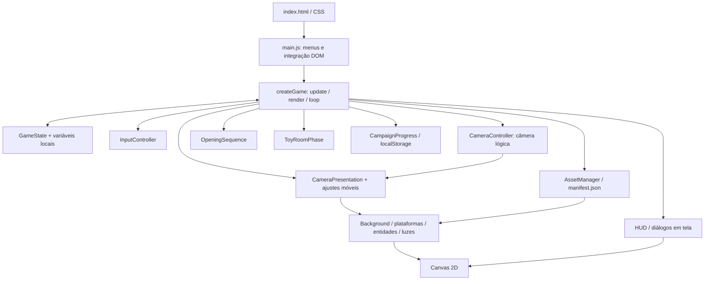

# Manual de desenvolvimento e integração de equipes

Projeto: **legendGirl — O Quarto dos Brinquedos**. Revisão documental: **06/10/2026**.

Este manual reúne as orientações do repositório e as confronta com a implementação disponível no workspace. Destina-se a desenvolvimento, QA, arte e manutenção da publicação. O código usa JavaScript com módulos ES, HTML, CSS e Canvas 2D; Node.js/Express serve os arquivos. Não há engine externa, compilação para `dist/`, backend de campanha ou contas de jogador.

Repositório de referência: [luciussama/legendGirl no GitHub](https://github.com/luciussama/legendGirl). A leitura direta do GitHub não estava disponível durante esta revisão; as fontes utilizadas são os arquivos da cópia local ligada a esse `origin`, incluindo alterações presentes no workspace. Este documento não afirma que essas alterações já estejam publicadas em `main`.

## Índice

1. [Primeiro dia e preparação](#primeiro-dia-e-preparação)
2. [Fontes e convenções](#fontes-e-convenções)
3. [Arquitetura e fluxo de execução](#arquitetura-e-fluxo-de-execução)
4. [Estado, física e persistência](#estado-física-e-persistência)
5. [Controllers](#controllers)
6. [Environment e pipeline visual](#environment-e-pipeline-visual)
7. [Entidades, efeitos e interface](#entidades-efeitos-e-interface)
8. [Assets e direção de arte](#assets-e-direção-de-arte)
9. [Sala de brinquedos](#sala-de-brinquedos)
10. [Receitas de manutenção](#receitas-de-manutenção)
11. [Testes e diagnóstico](#testes-e-diagnóstico)
12. [Publicação e integração de mudanças](#publicação-e-integração-de-mudanças)
13. [Roteiro de integração e glossário](#roteiro-de-integração-e-glossário)
14. [Referência detalhada de métodos](REFERENCIA-METODOS.md)
15. [Dicionário de bibliotecas e dependências](DEPENDENCIAS.md)
16. [Implementações atuais e fronteiras](#implementações-atuais-e-fronteiras)

## Primeiro dia e preparação

Use **Node.js 24** e npm, conforme [workflow de publicação](../.github/workflows/deploy-pages.yml). Chrome/DevTools atende a inspeção local; Android e iPhone reais são necessários para confirmar comportamento nativo. Git é necessário para versões, comparação de alterações e histórico de evidências.

```sh
git clone https://github.com/luciussama/legendGirl.git
cd legendGirl
npm ci
npm run dev
```

Abra `http://localhost:3000`. Não abra `index.html` por `file://`: módulos ES e manifesto dependem de HTTP. `npm start` executa o mesmo servidor. Para outra porta em shell compatível: `PORT=3001 npm run dev`.

`npm ci` instala o lockfile sem escolher versões novas. Mudanças de dependências devem versionar `package.json` e `package-lock.json` juntos.

Para estabelecer uma referência local antes da primeira alteração:

```sh
npm test
npm run check-assets
npm run lint
npm run build
```

Esses comandos não cobrem todas as ferramentas extras de QA. Confira os testes específicos na seção de validação. Registre falhas anteriores à sua alteração, sem modificar referências para fazê-las desaparecer.

Jogue a sequência abertura → castelo → fuga → porta falsa → plot twist → subida final → portal → sala de brinquedos. Nas fases de plataforma, o jogo conduz o deslocamento horizontal: toque/clique, Espaço ou seta para cima controlam salto/avanço de diálogo. O botão X do gamepad é o índice 2. Na sala, WASD/setas e joystick virtual controlam movimento; Espaço/E/Enter/F e o botão virtual acionam interação. Na Toy Room, o analógico esquerdo move e X (índice 2) interage; no primeiro salto da Dark Room, a nova pressão de A (índice 0) conclui o tutorial. P pausa; M alterna áudio.

## Fontes e convenções

| Fonte | Uso na integração |
| --- | --- |
| [README](../README.md) | Execução, controles, arquitetura geral, comandos e publicação. |
| [AGENTS.md](../AGENTS.md) | Idioma do projeto e restrições da direção visual. |
| [Verificação de plataformas](../tests/DARK_ROOM_VERIFICATION.md) | Contato, percurso, geometria e limites dos testes. |
| [Personagem oficial](../assets/art/dark-room/OFFICIAL-CHARACTER.md) | Origem imutável, recortes e regras de animação. |
| [Arte complementar](../assets/art/dark-room/modern/README.md) | Recursos ilustrados e calibração de apoios. |
| [Abertura](../assets/art/dark-room/opening/README.md) | Atlas narrativo, tempo e persistência da sequência. |
| [Organização de QA](../assets/qa-testers/README.md) | Destinos oficiais de evidências atuais e preservação das referências. |
| [Relatório atual](../assets/qa-testers/current-reports/relatorio.md) | Validação disponível e suas limitações. |

Comentários, documentação, interface e diagnósticos novos são escritos em português do Brasil. Preserve nomes de APIs, identificadores, comandos e caminhos. Não traduza dependências nem registros históricos externos.

A apresentação normal não deve desenhar réguas de pouso, linhas de hitbox ou realces técnicos sobre ilustrações. Hitboxes pertencem ao modo de depuração, desativado normalmente. A exceção documentada do relógio cuco (19) admite fixação sólida para os pés sem alterar a hitbox. Ajustes de arte não autorizam mudanças de física, layout ou dificuldade.

O guia de QA define `current-reports/`, `current-screenshots/`, `current-logs/`, `validation/` e `active-test-assets/` como organização oficial; o histórico pertence ao Git. Relatórios específicos de câmera/renderização também estão presentes no workspace. Consulte-os como evidência do defeito correspondente, sem transformar diretórios históricos ou comparações específicas em nova convenção geral de armazenamento.

## Arquitetura e fluxo de execução



| Área | Entrada / contrato | Responsabilidade |
| --- | --- | --- |
| Página | [main.js](../src/js/main.js) | Localiza elementos DOM, cria o jogo, conecta começar/continuar/recomeçar, pausa e som. |
| Coordenação | [game.js](../src/js/game.js), `createGame(canvas, uiFeedback, callbacks)` | Integra todos os subsistemas e escolhe o modo ativo. |
| Configuração | [config.js](../src/js/config.js) | Chão, layout, portas, entidades iniciais e atributos progressivos. |
| Estado | `state/` | Flags narrativas, transições, derrota e captura/restauração da campanha. |
| Controle | `controllers/` | Entrada, áudio, câmera e ajustes móveis. |
| Desenho | `environment/`, `entities/`, `effects/`, `ui/` | Materiais, sprites, luzes, transições e texto. |
| Exploração | `toy-room/` | Sala com câmera, entradas, móveis, colisões e coleta próprios. |
| Recursos | `assets/` em `src/js/` | Manifesto, imagens, caches, atlas e personagem oficial. |
| Diagnóstico | `debug/`, `tests/`, `scripts/` | Inspeção do atlas, fixtures e verificações automatizadas. |

`index.js` de cada pasta reexporta implementações; não contém um loop adicional. `input.js` e `toyRoom.js` preservam pontos de importação existentes. Prefira os pontos de entrada já usados pela área e evite introduzir dependências circulares.

### Ciclo do jogo e API pública

`createGame` cria estado, assets, áudio, câmera, partículas, abertura e entrada. `assetsReady` é a promessa de carregamento do manifesto/pré-carregamento. O primeiro desenho acontece antes do início da campanha. `start()` tenta restaurar progresso, inicia a abertura ou o modo salvo e agenda `requestAnimationFrame(loop)`.

`loop(currentTime)` calcula tempo relativo a 60 Hz e limita `dt` a **0,5..1,2**. É passo variável limitado, não um acumulador fixo. Quando pausado, continua desenhando, sem avançar `update`. Na sala de brinquedos, delega `update(dt)` e `render()` à instância própria. No quarto, chama `update(dt)`, sincronização e `render()`.

| API retornada por `createGame` | Uso e efeito |
| --- | --- |
| `start`, `newCampaign`, `hasProgress`, `saveProgress` | Início/restauração, limpeza da campanha, consulta e gravação. `newCampaign` é destrutivo para o progresso local; a UI já pede confirmação ao jogador. |
| `doJump(inputSource)`, `isGrounded`, `isCutsceneActive`, `setLastInputDevice` | Entrada contextual: salto ou interação narrativa respeitando bloqueios. |
| `togglePause`, `setPaused`, `isPaused` | Pausa da atualização; desenho permanece disponível. |
| `retry`, `resetToStart`, `restartToTitle`, `isGameOver` | Recuperação/derrota e retorno ao menu. |
| `startToyRoomPhase`, `isToyRoomMode` | Transição/delegação à sala. |
| `setMuted`, `toggleMute`, `isMuted`, `setMasterVolume`, `getMasterVolume`, `pauseMusic`, `resumeMusic` | Controle de áudio usado pela página. |
| `state`, `toyRoomIntroduction`, `camera`, `lighting`, `particles`, `transitions`, `background`, `platforms`, `hud`, `dialogue`, `assets`, `assetsReady`, `darkRoomAtlas`, `atlasDebugger`, `input`, `audio` | Referências expostas para integração/inspeção; não significam autorização para escrever arbitrariamente no estado. |
| `destroy` | Salva e remove listeners específicos de campanha/entrada/áudio. Não assuma que encerra todo RAF ou todo listener de resize: audite o ciclo de vida ao criar múltiplas instâncias. |

Os métodos internos `update`, `render`, `loop`, `syncStateToLocals` e `syncLocalsToState` não são APIs públicas normais. Fixtures de `tests/` expõem controles adicionais por instrumentação de código; não leve esses controles ao jogo distribuído.

## Estado, física e persistência

[StateVariables](../src/js/state/StateVariables.js) define `baby`, `fairy`, modo, câmera, prontidão, narrativa, relógios e buffers. [GameState](../src/js/state/GameState.js) implementa transições. `game.js` ainda contém movimento, impulso, pousos e coordenação narrativa; as seis sequências do quarto estão em `DarkRoomNarrative.js`. Não existe uma classe independente que concentre toda a física.

Há duas representações de parte do estado: propriedades de `GameState` e variáveis locais do coordenador. `syncLocalsToState` copia locais para o objeto; `syncStateToLocals` faz o inverso. Métodos que delegam a `GameState` usam essas passagens. A revisão de um campo novo deve identificar seu proprietário, leitores, escritores, publicação e persistência; não acrescentar automaticamente outro espelho. Permanecem 47 espelhos sincronizados, além de pausa/temporizador. Os quatro campos `cutsceneCompleted`, `lastUsedInputDevice`, `standbyStandUpProgress` e `standbyDialogueAlpha` já usam GameState diretamente. GameState ainda não é a única fonte de verdade.

### Métodos de estado por fluxo

| Métodos de `GameState` | Contrato |
| --- | --- |
| `setLastInputDevice`, `getActivePromptDevice` | Seleção das mensagens de entrada. |
| `startStandbyPreparation`, `confirmStandby` | Prontidão e confirmação para começar a ação. |
| `resetBabyPhysicsBody` | Reconfigura o corpo e flags transitórias; altera gameplay. |
| `triggerGameOver`, `showFailMessage`, `retryGame`, `restartToTitle`, `resetToStart` | Derrota, avisos e recuperação; recebimento de áudio quando aplicável. |
| `startCastleCutscene`, `advanceCutscene`, `finishCutscene` | Castelo e desbloqueio do percurso de fuga. |
| `startPlotTwistCutscene`, `advancePlotTwist`, `finishPlotTwistAndStartTutorial` | Porta falsa, reviravolta e entrada na terceira parte. |
| `startTruePortalTransition` | Preparação da passagem para a sala. |
| `spawnFairySparkles`, `spawnFairyFlightDust`, `updateFairyParticles` | Buffers visuais da guia; não confundí-los com seu controlador de movimento. |

`config.js` exporta `createBabyState`, `createFairyState`, `getEscapeStats(level)` e `getPhase3Stats(level)`. `platforms` contém 22 apoios e `phase3Platforms` contém 16. `standRegion` e `surfaceTopY` podem definir a região real de chegada; a extensão da ilustração não equivale automaticamente à colisão.

### Save

[CampaignProgress](../src/js/state/CampaignProgress.js) usa `legendGirl.campaign.v1` em `localStorage`. `captureState` seleciona chaves dos defaults excluindo referências de runtime, relógios da página, instâncias e entrada transitória. `restoreState` preserva referências de arrays/objetos quando aplicável. `createCampaignProgress(storage)` retorna `read`, `write`, `clear`, valida versão/forma e mantém alternativa em memória quando o armazenamento falha.

O pacote salvo também contém `OpeningSequence.snapshot()`, estado de ativação das plataformas e `ToyRoomPhase.snapshot()` quando relevante. `ToyRoomPhase.restore` religa o objeto carregado por ID; não basta desserializar uma cópia desconectada do brinquedo.

Ao adicionar campo persistente: defina default serializável, revise captura/restauração/validação, teste saves anteriores incompletos, continuidade de narrativa e alternativa sem storage. A versão não tem migração genérica pronta. DOM, nós de áudio, timers e controllers não devem ser serializados como estado da campanha.

## Tutorial do primeiro salto

O fluxo é `CUTSCENE → FIRST_JUMP_TUTORIAL → GAMEPLAY_NORMAL`. A espera suspende a atualização, mantendo renderização e entrada ativas. Um salto aceito conclui o tutorial uma vez por save, usando `firstJumpTutorialCompleted`. Consulte o [guia técnico completo](TUTORIAL-PRIMEIRO-SALTO.md) para métodos, campos, eventos, migração, coordenadas, testes e evolução. Este sistema é independente do tutorial após o plot twist.

## Controllers

| Controller / funções | Métodos centrais | Contrato e cuidados |
| --- | --- | --- |
| [InputController](../src/js/controllers/InputController.js) | `init`, `triggerJump`, `handlePointerDown`, `handleKeyDown`, `pollGamepad`, `gamepadLoop`, `startGamepadPollingLoop`, `handleGamepadDisconnected`, `destroy`; fábrica `bindInput` | Debounce padrão 140 ms, ponteiro primário, borda de subida de A no primeiro tutorial e X no gameplay normal, bloqueios de UI/solo/narrativa. A fábrica retorna `controller`, `pollGamepad`, `destroy`. |
| [AudioController](../src/js/controllers/AudioController.js) | `init`, handlers de foco/visibilidade, `onBackground`, `onForeground`, volume/mudo, delegações `play*`/`start*`/`stop*`, `destroy` | Integra `createAudioSystem` e respeita silenciamento do usuário. Inicialização de áudio depende das políticas do navegador e interação. |
| [CameraController](../src/js/controllers/CameraController.js) | `reset`, `setZoom`, `setPosition`, `update`, `syncFromState`, `syncToState`, `applyTransform` | Câmera lógica: rolagem, limites, derrota por atraso e clamp que escreve em `baby.y`/`baby.vy`. Não é somente estética. `setPosition(..., false)` ajusta o alvo vertical, não um follow horizontal genérico. |
| [CameraPresentation](../src/js/controllers/CameraPresentation.js) | `reset`, `snapshot`, `restore`, `frame`, `mobileFrame` | Histórico visual independente; estabilização após pouso, limites de deslocamento e interpolação de transições. Não escreve na simulação. |
| [AndroidFraming](../src/js/controllers/AndroidFraming.js) | `androidFrameOffset`, `createAndroidFraming().offset` | Reserva inferior e insets; limita elevação para preservar o topo. Saída é um deslocamento de apresentação. |
| [MobileZoom](../src/js/controllers/MobileZoom.js) | `isMobileDevice`, `getMobileZoomFrame` | Retorna `{zoom,x,y}`. Modo normal aproxima até 1,18; modo estável da reviravolta/subida usa 0,8. Portanto “zoom móvel até 18%” não descreve sozinho todos os trechos atuais. |
| [EscapeFairyGuide](../src/js/controllers/EscapeFairyGuide.js) | `getEscapeGuideTarget`, `updateEscapeFairyGuide` | Próximo apoio/porta e amortecimento crítico na fuga entre castelo e plot twist. **Atualiza movimento da fada**; mudanças aqui não são simples renderização. |

### Referenciais de câmera

Mantenha separados mundo, desenho relativo à câmera, bitmap do canvas e pixels CSS. `cameraX`/`cameraY` lógicos não descrevem sozinhos a imagem final: há pose visual, zoom, foco e offsets adicionais. Renderizadores de objetos normalmente recebem `camX` e desenham `worldX - camX`; o contexto já contém a transformação restante. Não subtraia a câmera outra vez dentro de uma camada já preparada.

`CameraController.applyTransform` aceita `presentationY`, `presentationX` e `sourceX` para conciliar o desenho relativo à câmera original com a pose visual. `getTransform()` é a referência da composição real. A iluminação deve copiar essa matriz; o HUD deve ser desenhado após restaurar a transformação da cena.

Um viewport CSS 390 × 844 não implica bitmap 390 × 844. `handleResize` delega a `createViewportController().resize()`, que usa largura interna 540 em retrato, altura 540 em paisagem e ajusta o outro eixo por proporção. Converta métricas de jitter para pixels visuais antes de comparar resultados.

## Environment e pipeline visual

| Módulo | Métodos / dados | Responsabilidade |
| --- | --- | --- |
| [BackgroundRenderer](../src/js/environment/BackgroundRenderer.js) | `setAssets`, `drawAtlasSceneryItem`, `renderWall`, `renderScenery`, `render`; helper `getBackgroundViewport` | Parede, parallax, janelas, desenhos, guirlandas, piso e objetos decorativos. O helper inverte a matriz para calcular a cobertura visível real. |
| [PlatformRenderer](../src/js/environment/PlatformRenderer.js) | `setAssets`, `drawAtlasPlatformSprite`, `renderPlatforms`, `renderExitDoor`, `renderTrueExitDoor`, `renderTutorialArrow`; `PLATFORM_SURFACES` | Desenho de apoios/portas e calibração dos recortes. `cameraVisibility` permite descarte considerando a matriz real. Física não deve ser recalibrada para compensar um sprite. |
| [StorybookPlatforms](../src/js/environment/StorybookPlatforms.js) | `drawStorybookPlatform`, `drawContactEdge` e helpers internos | Desenhos de materiais/objetos; apoios integrados ao objeto. `drawContactEdge` não autoriza linhas auxiliares sobre arte fora das regras de `AGENTS.md`. |
| [LightingSystem](../src/js/environment/LightingSystem.js) | `resize`, `apply`; fábrica `createLightingSystem` | Canvas auxiliar de escuridão, recortes de luz, feixes, brilho e vinheta. |
| [nightWindows](../src/js/environment/nightWindows.js) | `NIGHT_WINDOWS` | Posições compartilhadas das janelas entre background e luz. Evita divergência visual de fontes. |
| [environment/index.js](../src/js/environment/index.js) | Reexportações | Entrada dos renderizadores e fábrica de iluminação. |

### Ordem de desenho no quarto

1. Limpa o canvas; abertura não revelada usa o caminho próprio de `OpeningSequence`.
2. Calcula pose visual, limites da cena, offset Android e enquadramento móvel.
3. Salva o contexto e aplica translação/escala móvel, offset vertical e transformação da câmera.
4. Desenha parede, decoração, plataformas, porta falsa/verdadeira e seta do tutorial.
5. Desenha rastros, poeira, fadinha e menina.
6. Aplica a atmosfera: máscara de escuridão, luzes e vinheta.
7. Obtém a matriz da cena, restaura o contexto e aplica `ArtFinish`.
8. Desenha HUD, tutorial do primeiro salto em coordenadas de tela, diálogos, fade da abertura e transição do portal; telas finais conforme estado.

`LightingSystem.apply` limpa/reconstrói a máscara com `source-over`, recorta com `destination-out` na matriz real, compõe `multiply` em tela, aplica brilhos com `screen` e vinheta em tela. Um `globalCompositeOperation` não restaurado pode contaminar frames futuros. Use pares equilibrados de `save`/`restore`.

### Diagnóstico de faixa clara ou camada deslocada

Não atribua o defeito à câmera apenas pela proximidade de uma alteração. Capture uma pose reproduzível, a matriz aplicada, dimensões CSS/internas e alpha de cada estágio. Desative uma camada por vez na fixture. Diferencie parallax intencional de erro de referencial.

O caso QA-VISUAL-001 demonstrou que limitar o fundo a `0..canvas.width` sob zoom/offset expõe transparência. Compor a máscara sobre essa área mostra sua própria cor acinzentada. A correção de cobertura fica em `BackgroundRenderer`, sem mudar física ou lógica da câmera. Testes relacionados: `test-background-viewport.js`, `test-lighting.js` e fixture `dark-room-visual-layers.html`.

## Entidades, efeitos e interface

| Módulo | Métodos principais | Uso |
| --- | --- | --- |
| [BabyRenderer](../src/js/entities/BabyRenderer.js) | `setAssets`, `resolveAnimationState`, `renderPose`, `render` | Escolhe poses oficiais e desenha a partir do centro/pés; escala visual não altera hitbox. |
| [FairyRenderer](../src/js/entities/FairyRenderer.js) | `render` | Desenha fadinha e partículas a partir do estado recebido; movimento pertence à atualização. |
| [ParticleSystem](../src/js/effects/ParticleSystem.js) | `clear`, `spawnBabyJumpDust`, `spawnBabyJumpPuff`, `spawnBabyLandingPuff`, `spawnPhase3Ribbons`, `spawnEscapeRibbons`, `update`, `updateBabyJumpDust`, `updateSpeedRibbons`, `renderSpeedRibbons`, `renderBabyJumpDust`, `render` | Buffers de partículas atualizados por `dt` e desenhados na cena. |
| [TransitionEffects](../src/js/effects/TransitionEffects.js) | `renderPortalWipe` | Envelope de luz do portal; pode receber `presentationTransform` para coordenadas móveis. |
| [ArtFinish](../src/js/effects/ArtFinish.js) | `applyArtFinish` | Dessaturação de 12% por composição `saturation`, em tela. |
| [OpeningSequence](../src/js/cinematics/OpeningSequence.js) | `hasCompleted`, `start`, `cancel`, `reset`, `snapshot`, `restore`, `update`, `renderFade`, `render` | Relógio e cues da abertura; callbacks `onReveal`, `onComplete`, `onCue`. A cena dura 37,5 s de jogo. |
| [HudRenderer](../src/js/ui/HudRenderer.js) | `renderEscapeBanner` | Mensagens/nível da fuga e subida. |
| [DialogueRenderer](../src/js/ui/DialogueRenderer.js) | `drawPortrait`, `wrapText`, `renderCutsceneDialogue` | Retratos, quebra de linhas, texto e prompts. |
| [DialogueSafeArea](../src/js/ui/DialogueSafeArea.js) | `intersectCanvasSafeArea`, `getDialogueSafeArea`, `getDialogueBoxY` | Interseção do canvas com viewport/insets; converte para bitmap. |
| [MobileDialogueRegion](../src/js/ui/MobileDialogueRegion.js) | `getMobileDialogueRegions`, `renderMobileDialogueRegion` | Área superior de cena e painel inferior de fala. |

A abertura tem estado e persistência próprios, além do pacote de campanha. Alterar cues exige testar pausa, recarga incompleta, retorno de foco e término da abertura. Áudio de foco não deve reativar som explicitamente silenciado pelo jogador.

## Assets e direção de arte

[AssetManager](../src/js/assets/AssetManager.js) lê [manifest.json](../assets/manifest.json), mantém `images`, `statuses`, `regionCache` e `manifestStatus`. As entradas de `images` são pré-carregadas; os recortes são solicitados sob demanda.

| Método | Entrada / saída e cuidado |
| --- | --- |
| `loadManifest(url)` | Promessa do manifesto; falha rejeita e define status `error`. |
| `preload()` | Promessa do mapa de imagens. Uma imagem ausente pode resolver `null` sem rejeitar toda a operação. |
| `loadImage(key, source)` | Carrega/cacheia imagem e aplica tratamentos somente às chaves específicas existentes. |
| `get`, `has`, `getStatus`, `isReady` | Consulta disponibilidade. `isReady()` sem chave verifica manifesto, não a integridade de todos os assets. |
| `getRegion(key, {x,y,width,height})` | Retorna canvas de recorte ou `null`; rejeita limites inválidos e usa cache. |
| `removeSolidBackground`, `normalizeCharacterPalette` | Processamento de imagens específicas; não aplique genericamente à personagem oficial. |
| `clearRegionCache` | Invalida recortes; revise quando mudar atlas durante a sessão. |

`darkRoomAtlas.js` define regiões e `officialCharacter.js` contém frames e SHA-256 da fonte oficial. Não suponha o formato pelo sufixo: a fonte `official-sprites.png` é JPEG conforme guia. `generate-dream-girl-sprites.js` recorta a fonte preservando os pixels autorizados. O carregamento ausente não deve introduzir personagem substituta.

`AtlasDebugger.setAssets`, `validateAllRegions`, `initDOM`, `toggle`, `render` ajudam a inspecionar recortes, dimensões e sobreposição. Utilize modo técnico para depuração; o overlay não deve ficar ligado na apresentação normal.

## Sala de brinquedos

[ToyRoomPhase](../src/js/toy-room/ToyRoomPhase.js) mantém dados de sala, câmera, jogador, fada, móveis, brinquedos, objeto carregado, contagem organizada, entradas e efeitos. Esses dados não são o mesmo objeto `baby` da fase lateral.

| Grupo de métodos | Responsabilidade |
| --- | --- |
| `setupListeners`, `handleKeyDown`, `handleKeyUp`, `onPointerDown`, `onPointerMove`, `onPointerUp` | Instala e processa controles próprios. `destroy` remove seus listeners. |
| `getCanvasCoordinates`, `isActionButtonHit` | Converte ponteiro e testa área da ação; não usar coordenadas CSS diretamente em física do mundo. |
| `triggerAction` | Pegar/soltar/organizar, sujeito à distância e estado existentes. |
| `resolveCollisions` | Resolve colisões com móveis; altera gameplay. |
| `spawnSparkles`, `spawnConfetti` | Efeitos de interação/vitória. |
| `update`, `render` | Avança o modo e compõe a cena. |
| `snapshot`, `restore` | Captura serializável e reconexão do brinquedo carregado por ID. |

A fábrica `createToyRoom` retorna `update`, `render`, `triggerAction`, `destroy` e `instance`. `RoomEnvironmentRenderer` implementa `renderBackground`, `renderPerspectiveFloor`, janelas, portal, tapetes, trilhos e `renderFurniture`; `ToyRenderer.renderToy` desenha os itens; `ToyRoomEntities.renderPlayer/renderFairy` desenha os atores; `ToyRoomUI.renderUI` desenha a interface.

Móveis e brinquedos iniciais estão no construtor da fase; não procure todo o layout da sala em `config.js`. Adicionar item exige revisar inicialização, interação, contagem de vitória e snapshot/restauração, além do desenho.

## Implementações atuais e fronteiras

A implementação usa composição de instâncias e funções por domínio. Os nomes de arquivo abaixo não implicam que todos sejam classes: ViewportController, CameraQaObserver e RuntimeContext são fábricas; DarkRoomNarrative e DarkRoomRenderPipeline exportam funções. As classes dos demais domínios continuam descritas nas tabelas deste manual; suas assinaturas estão na [referência completa](REFERENCIA-METODOS.md).

| Módulo / forma | Responsabilidade e dependências | Funções e contratos centrais |
| --- | --- | --- |
| [RuntimeContext](../src/js/runtime/RuntimeContext.js), fábrica | Agrega `state`, `audio`, `camera`, `assets`, `input`, `effects`, `campaign` com as mesmas referências existentes. Não gerencia lifecycle nem resolve dependências. | `createRuntimeContext({...})` devolve objeto simples. No jogo atual `input` é o adaptador `inputHandler` e `effects` é `particles`; não é um registro de todos os efeitos. Não elimina espelhos nem injeta contexto universalmente. |
| [ViewportController](../src/js/controllers/ViewportController.js), fábrica | Mede rect CSS (fallback `host.innerWidth/innerHeight`), calcula aspecto, redimensiona Canvas principal/auxiliar e iluminação. | `createViewportController({...})` devolve `resize()`. Chama `onOrientation(aspect < 1.15)` antes de redimensionar. O callback mantém `isPortrait` local em game.js; publicação posterior permanece necessária. Listeners continuam no coordenador. Não calcula safe area nem política de zoom mobile. |
| [CameraQaObserver](../src/js/debug/CameraQaObserver.js), fábrica | Instrumentação optativa; depende de `host.location`, callback `host.cameraQaRecord` e função `snapshot`. | `createCameraQaObserver({...}).record(transform = null)` chama snapshot/callback somente com parâmetro `cameraQa` presente e callback válido. Não armazena nova câmera. |
| [DarkRoomRenderPipeline](../src/js/rendering/DarkRoomRenderPipeline.js), função | Composição da cena: branches de introdução/abertura, apresentação, camadas, iluminação, HUD e diálogos. Recebe objetos, escalares e callbacks de desenho. | `renderDarkRoom(context)` aplica MobileZoom → offset Android → CameraController.applyTransform; preserva save/restore do Canvas e emissão QA. Não executa update de simulação. Alguns callbacks de desenho ainda publicam locais em GameState: o render completo não é puro. |
| [DarkRoomNarrative](../src/js/narrative/DarkRoomNarrative.js), funções | Seis sequências do quarto: atores, foco/zoom, partículas, diálogo, bloqueios e gatilhos; recebe contexto específico e dt. | `updateStandbyNarrative`, `updateTransicaoStandbyNarrative`, `updateCasteloNarrative`, `updateReviravoltaNarrative`, `updateTutorialRetornoNarrative`, `updatePortalNarrative`. Não possuem armazenamento próprio; game.update seleciona uma e retorna antes do update normal da câmera. |
| [ToyRoomIntroduction](../src/js/cinematics/ToyRoomIntroduction.js), classe | Sequência cinemática antes da sala ativa; usa sala temporária com `bindInputs:false`, imagem de saída e áudio. Não executa a simulação normal da sala. | `start(context)` prepara/inicia; `update(dt)` avança relógio e eventos; `stage`/`dialogue` consultam cena; `cameraFrame(canvas)`/`fairyPosition()` calculam composição; `render`/`drawDialogue` desenham; `cancel()` encerra. `onComplete` abre sala ativa. |
| [ToyCarryPresentation](../src/js/toy-room/ToyCarryPresentation.js), função/dados | Composição visual da pose de transporte e sobreposição de dedos/pernas; não muda a regra de carregar. Depende de assets, jogador e ToyRenderer. | `renderToyCarry(ctx, player, options)` usa `CARRY_PROFILES` por tipo para escala/âncora. Retorna false se faltar pose ou brinquedo, permitindo o caminho alternativo do renderizador. Não serializa perfis ou Canvas no save. |
| [ToyRoomTutorial](../src/js/toy-room/ToyRoomTutorial.js), classe | Orientação de movimento e primeira coleta; mantém alvo visual dinâmico e dispositivo de entrada. Não executa coleta ou movimento do jogador. | `start()` respeita conclusão persistida; `setDevice()` muda instrução; `nearest()` escolhe item elegível; `update(dt)` avança de movement para pickup após deslocamento >2 e conclui quando há carriedItem; `guidePosition()`/`message` orientam; `render()` projeta painel; `finish()` marca conclusão/TOY_ROOM_GAMEPLAY. |

### Catálogo das classes

As 24 classes declaradas em src/js têm os papéis abaixo. Objetos de entidade (baby, fairy, player), dados de configuração e fábricas não são classes adicionais. Métodos privados/internos não constituem APIs estáveis.

| Classe | Responsabilidade / estado próprio | Funções para começar a leitura |
| --- | --- | --- |
| AssetManager | Manifesto, imagens, status e cache de recortes; não define gameplay. | loadManifest, preload, get, getRegion |
| GameState | Defaults e comandos de prontidão, derrota, narrativa e progresso; pode alterar corpo físico. | startStandbyPreparation, resetToStart, triggerGameOver, finishCutscene |
| InputController | Eventos, debounce, dispositivo e bordas de gamepad; delega salto ao jogo. | init, triggerJump, handleKeyDown, handlePointerDown, pollGamepad, destroy |
| AudioController | Integra áudio, foco/visibilidade, mute e lifecycle. | init, onBackground, onForeground, destroy e delegações play* |
| CameraController | Pose/alvos, follow, rolagem, teto e derrota; congelado arquiteturalmente. | update, syncFromState, syncToState, applyTransform |
| CameraPresentation | Histórico visual e estabilização da pose/enquadramento; separado da física. | frame, mobileFrame, reset, snapshot, restore |
| BackgroundRenderer | Parede e cenário com atlas, parallax e cobertura do viewport. | setAssets, renderWall, renderScenery |
| PlatformRenderer | Ilustrações de apoios e portas; não resolve colisões. | renderPlatforms, renderExitDoor, renderTrueExitDoor |
| LightingSystem | Canvas auxiliar, máscara de escuridão e luzes. | resize, apply |
| BabyRenderer | Seleciona e desenha recortes da personagem oficial. | resolveAnimationState, renderPose |
| FairyRenderer | Desenha fada e efeitos da representação; não substitui sua guia de movimento. | render |
| ParticleSystem | Buffers de poeira/rastros e sua evolução visual. | spawnBabyJumpPuff, spawnBabyLandingPuff, update e render* |
| TransitionEffects | Desenho da íris/transição do portal; relógio é fornecido pelo fluxo. | renderPortalWipe |
| HudRenderer | Desenha faixa de fuga/progresso em tela. | renderEscapeBanner |
| DialogueRenderer | Texto, retratos e prompt seguro; mede/quebra linhas. | renderCutsceneDialogue, wrapText |
| AtlasDebugger | Inspeciona/valida regiões do atlas em modo técnico. | validateAllRegions |
| OpeningSequence | Relógio/etapas da abertura, revelação e conclusão recuperável. | start, update, render, snapshot, restore |
| ToyRoomIntroduction | Relógio e composição da transição para a segunda fase; callbacks e panorama. | start, update, cameraFrame, render, cancel |
| ToyRoomPhase | Jogador, brinquedos, móveis, colisões, inputs, follow independente e save da sala. | triggerAction, resolveCollisions, update, render, snapshot, restore, destroy |
| ToyRoomTutorial | Etapas movement/pickup, alvo e instrução por dispositivo; usa estado da fase. | start, update, nearest, guidePosition, finish, render |
| RoomEnvironmentRenderer | Desenha arquitetura e móveis da sala. | renderBackground, renderFurniture |
| ToyRenderer | Desenha brinquedos, seleção e apresentação de itens. | renderToy |
| ToyRoomEntities | Desenha protagonista/fada da sala com assets/alternativas. | renderPlayer, renderFairy |
| ToyRoomUI | HUD, joystick, ações e faixas da sala. | renderUI |

Para cada classe, a [referência de métodos](REFERENCIA-METODOS.md) contém assinatura, linha e link de implementação. As tabelas de domínio acima explicam os efeitos e as dependências; use ambas para evitar confundir um renderizador com o dono da regra do jogo.

### Sequenciamento, contexto e publicação

`main.js → createGame → update/render` continua sendo a entrada. O contexto narrativo usa `narrativeState`, um Proxy sobre GameState. `narrativeBindings` intercepta campos ainda espelhados e escreve nos locais de game.js; campos não interceptados usam GameState. Não assumir que `context.state.cameraX = ...` publica imediatamente no GameState real. O contexto de render recebe os valores do quadro explicitamente; RuntimeContext agrega serviços já criados no final de createGame e fornece referências aos contextos narrativo e de render. O próprio objeto runtimeContext não é exposto na API pública.

As barreiras atuais são: comando de estado (locais → GameState → comando → locais); câmera normal (locais → GameState → controlador → update → GameState → locais); narrativa (escritas pelo Proxy → publicação posterior no loop); save (publicar locais → capturar estado). Resize não substitui nenhuma dessas barreiras.

**CameraController está congelado arquiteturalmente.** Não adicionar responsabilidades nem continuar sua extração agora. Ele altera teto físico (`baby.y/vy`), velocidade de rolagem e derrota por atraso. `applyTransform` continua no controlador; CameraTransformApplier não existe. Intenção narrativa, pose lógica, apresentação, geometria do viewport e simulação são fronteiras diferentes. A decisão e as limitações de validação estão no [encerramento da trilha](qa/ENCERRAMENTO-REFATORACAO-CAMERA.md); relatórios intermediários dessa investigação foram removidos.

### Entrada e tutorial da Toy Room

Portal e botão de ir à segunda fase usam a introdução, antes de liberar os controles. Etapas `TR_002` a `TR_008`: 0,8 / 2,5 / 4 / 4 / 7 / 2 / 3 segundos. O relógio soma dt/60; TR_006 prioriza leitura por sete segundos. Eventos são enviados ao callback `onNarrativeEvent` e por CustomEvent no Canvas; `TOY_ROOM_START` inicia o tutorial da instância ativa. Não confundir o panorama narrativo com cameraX/Y do follow da sala.

`ToyRoomPhase.startTutorial()` e `pollGamepad()` integram ToyRoomTutorial. `TOY_ROOM_INPUT` centraliza teclas de ação, rótulo E, índice 2 e rótulo X. O polling aceita pads padrão (ou sem mapping declarado), usa axes[0]/axes[1], deadzone radial 0,18 e borda de pressão do botão para `triggerAction()`. O vetor segue o mesmo update/colisões dos outros controles. A guia escolhe brinquedos não organizados/não carregados; troca de alvo usa cooldown de 30 passos, distância de 280 e vantagem de 40, para evitar oscilação. A posição sugerida da fada fica 105 acima do alvo.

O save da sala inclui `toyRoomTutorialCompleted`; restore encerra tutorial já concluído ou reinicia orientação quando necessário. `ToyCarryPresentation` continua responsável pela composição visual de transporte (pose e contatos), separada da regra de pegar/guardar. As implementações de arte atuais podem diferir de auditorias históricas; a presença de asset no manifesto não prova uso pelo renderizador.

## Receitas de manutenção

### Acrescentar um asset visual

1. Identifique a fonte e as regras de identidade/material; preserve a origem oficial.
2. Adicione o recurso no caminho de arte adequado e registre a chave em `manifest.json`.
3. Atualize a região no atlas se o recurso for uma prancha; valide bounds reais.
4. Consuma `assets.get`/`getRegion` no renderizador, com comportamento explícito de ausência.
5. Calibre escala/âncora visual usando o plano dos pés ou apoio físico existente. Não altere `standRegion`, hitbox ou distâncias para acomodar a arte.
6. Rode check-assets, testes do personagem/apoios aplicáveis e inspecione capturas nos três formatos.

### Acrescentar uma camada de cenário

Receba o contexto e os dados necessários; mantenha o estado de desenho dentro de `save`/`restore`. Defina se usa mundo, câmera relativa, parallax ou tela. Use a matriz real para máscara/culling/cobertura; não reaplique zoom. Insira a chamada na posição correta do pipeline e faça isolamento da camada em fixture. Verifique alpha, bordas e resize, mantendo a atualização do gameplay idêntica.

### Alterar controlador ou regra

Escreva primeiro o comportamento desejado e os estados afetados. Mudança de entrada deve cobrir repetição, multi-touch, overlays e bloqueios de cena. Mudança de câmera lógica pode alterar derrota/teto e deve ser tratada como mudança de gameplay. Para correções visuais, prefira a apresentação independente e confirme as trajetórias antes/depois. Mudança de guia da fada exige teste específico, pois escreve em suas coordenadas e velocidades.

### Acrescentar cena ou diálogo

Revise flags/defaults, sincronização local/estado, gatilho/avanço/término em `GameState` e `game.js`, conteúdo e desenho em `DialogueRenderer`, pausa/entrada e callbacks de áudio. Teste recarga no meio da cena, retorno ao menu e safe area móvel. Alterar texto pode aumentar linhas: valide altura e não apenas o conteúdo.

### Acrescentar campo de campanha

Defina default; inclua nas sincronizações; determine se deve persistir; revise `captureState`, `restoreState`, validação de `read` e captura específica da sala/abertura. Teste serialização, referência dos arrays/objetos e dados anteriores. Nunca use o save para guardar contexto Canvas, referências DOM ou nós de áudio.

### Ajustar uma plataforma

Diferencie alteração artística de alteração de design. Arte: modifique renderer/atlas/calibração mantendo configuração física. Design autorizado: revise layout, progressão, alcance, colisões, checkpoints e referência de física como mudança explícita de gameplay. Não atualize `dark-room-physics.json` para acomodar arte ou fazer um teste passar.

## Testes e diagnóstico

Na validação de encerramento de 06/10/2026, npm test/build/lint/check-assets, percurso completo e tutorial Toy Room passaram. Três scripts permanentes do primeiro salto falharam antes/depois da limpeza: `test-first-jump-tutorial-browser.js`, `test-first-jump-prompt-browser.js` e `test-first-jump-completion-browser.js`; a aplicação real passou nos cenários testados. Portanto `npm run test:tutorial:browser` não está integralmente aprovado. Consulte o [registro permanente](qa/ENCERRAMENTO-REFATORACAO-CAMERA.md) para mensagens e limites; não alterar asserções ou referências apenas para obter verde.

O harness visual é parcialmente determinístico: performance.now, timers/RAF e storage compartilhado podem gerar diferenças sem mudança de implementação. Seed fixa exige mesma ordem de sorteios; pausa continua desenhando e não congela o pulso. Comparações exigem controlar pré-condições e validar A/B da mesma versão, sem mascarar diferenças. Isso permanece uma limitação, não uma estabilização implementada.


| Comando / ferramenta | Quando usar | Limite |
| --- | --- | --- |
| `npm test` | Regressão geral antes de integrar código. | Não executa todos os scripts específicos nem valida hardware móvel. |
| `npm run verify:dark-room` | Apoios, pés, salto do castelo, personagem, partículas e guia. | Referência física precisa ser preservada em correções visuais. |
| `npm run test:pages`, `npm run build` | Páginas e caminhos de publicação em subpasta. | `build` valida; não transpila nem produz `dist/`. |
| `npm run check-assets` | Manifesto e arquivos. | Disponibilidade de arquivo não garante recorte/arte corretos. |
| `npm run lint` | Sintaxe dos dois arquivos configurados. | Não é ESLint nem análise de todo `src/`. |
| `node scripts/test-opening-sequence.js` | Abertura/cues/poses e persistência. | Combine com inspeção visual. |
| `node scripts/test-physics-scenarios.js` | Cenários adicionais de física. | Não substitui percurso completo. |
| `node scripts/test-lighting.js`, `node scripts/test-background-viewport.js` | Máscara, matriz, cobertura e invariância visual. | São extras: não estão no `npm test` atual. |
| `node scripts/test-camera-presentation.js` | Damping visual, estabilização, limites e checkpoints. | Não mede percepção em dispositivo real. |
| `node scripts/test-mobile-zoom.js`, `node scripts/test-android-framing.js`, `node scripts/test-dialogue-safe-area.js`, `node scripts/test-mobile-dialogue-region.js` | Enquadramento e texto móveis. | Adicione retrato/paisagem/insets em revisão manual. |
| `node scripts/verify-full-browser.js android` / `iphone` / `desktop` | Sequência completa até organizar os oito objetos. | Busca instantes de salto com snapshots; não representa julgamento humano. |

### Navegador instrumentado

Os scripts CDP exigem servidor na porta 3000 e Chrome dedicado em 9222. Feche a instância dedicada ao terminar, preservando o navegador pessoal. Exemplo no macOS, ajuste o binário ao seu sistema:

```sh
"/Applications/Google Chrome.app/Contents/MacOS/Google Chrome" --remote-debugging-port=9222 --user-data-dir=/tmp/legendgirl-qa
node scripts/verify-full-browser.js android
node scripts/verify-full-browser.js iphone
node scripts/verify-full-browser.js desktop
```

Algumas revisões específicas usam porta 3001; confira o cabeçalho do script, em vez de assumir uma porta universal. Fixtures como `dark-room-playthrough.html` podem importar o código real via Blob e expor atualização controlada, preparação e checkpoints. Isso não é uma API de produção e depende de marcadores textuais: refatorações devem revisar a fixture.

Em comparações, fixe a semente, restaure aleatoriedade/checkpoints e descarte tentativas de busca que não pertencem ao percurso aceito. Meça a transformação visual, não apenas `cameraX`. Faça captura no mesmo frame das métricas; resize e composição atrasada podem gerar imagens de outro frame. `qa-visual-layers.js` exporta diretamente o canvas para evitar esse descompasso.

### Critérios móveis e de câmera

Os critérios de QA-CAMERA-002C incluem jitter parado <=1 px visual em 60 frames, salto de posição <=5% da tela por frame, recuperação do pouso <=300 ms, zoom <=2% sem evento narrativo, região de chegada visível antes do salto e fada visível >=95% do plot twist. Não confunda desvio padrão da câmera em movimento com jitter parado. Relate pousos sem janela suficiente como não medidos, em vez de aprovados.

Emulação de user agent/viewport no Chrome não executa Safari/WebKit nem GPU e frame pacing do aparelho. A matriz mínima de integração é Desktop, Android e iPhone; registre navegador, orientação, viewport, versão, dispositivo, cenas medidas e limites. Declare aprovação nativa apenas quando executada.

### Diagnóstico de problemas frequentes

| Sintoma | Primeiras verificações |
| --- | --- |
| Tela vazia / módulo não carrega | HTTP, aba Network, URL/case do import, tipo de conteúdo e caminhos relativos. O fallback do Express pode devolver HTML para caminho inexistente. |
| Sprite ausente | Manifesto, `getStatus(key)`, bounds de `getRegion`, preload e transparência do atlas. |
| Pés fora do apoio | Compare `surfaceTopY`/`standRegion` com âncora visual e escala; não modifique física automaticamente. |
| Faixa cinza / borda vertical | Cobertura do background pela inversa da matriz, alpha intermediário e composição da máscara. |
| Jitter / zoom oscilante | Targets, troca de próximo apoio, composição dos offsets e zoom, pose lógica versus visual. |
| Progresso não restaura | Origem do localStorage, versão/validação, sincronizações e armazenamento bloqueado. |
| Som não toca / volta indevidamente | Gesto de inicialização, mudo do usuário, foco/visibilidade e faixas ativas. |
| Clique gera ação repetida | Ponteiro primário, debounce, repetição de teclado, múltiplos listeners/instâncias. |
| Erro aparentemente silencioso | `main.js` previne eventos globais `error`/`unhandledrejection`; use DevTools e coleta própria na fixture, sem depender só de overlays. |
| CDP falha | Chrome dedicado realmente aberto em 9222, servidor da fixture na porta esperada e permissões locais. |

## Publicação e integração de mudanças

O [workflow](../.github/workflows/deploy-pages.yml) roda em push para `main` e execução manual. Faz checkout, exige lockfile, configura Node 24, instala com `npm ci`, executa check-assets/lint/test-pages/build, prepara `_site` e publica Pages. **Não roda `npm test` completo atualmente**: execute as regressões relevantes antes de integrar.

GitHub Pages serve arquivos estáticos e não executa Express. Os caminhos devem funcionar na subpasta do repositório.

Fluxo sugerido para equipes novas, sem impor políticas de branch/revisão que o repositório não define:

1. Faça branch de trabalho a partir da base acordada pela equipe e examine `git status` para não sobrescrever trabalho existente.
2. Defina escopo, arquivos e critérios; separe alteração visual de mudança de gameplay.
3. Implemente com métodos pequenos e contratos coerentes com a área existente.
4. Execute testes proporcionais, valide captura/tempo e registre limitações reais.
5. Abra revisão com problema, comportamento resultante, arquivos, testes/evidências e impacto em física/save/assets.
6. Atualize documentação e referência de métodos quando contratos mudarem. A publicação em `main` ocorre pelo workflow existente.

Na revisão, confira listeners/RAF, referências preservadas no save, estado não escrito pelo desenho, restauração do contexto e paths estáticos. A confirmação sobre dificuldade deve distinguir parâmetros mecânicos de percepção humana: igualdade de trajetória não certifica conforto visual.

## Roteiro de integração e glossário

| Etapa sugerida | Atividade | Evidência de conclusão |
| --- | --- | --- |
| Primeiro dia | Executar projeto/testes, ler convenções e jogar os modos. | Ambiente funcional e referência de testes registrada. |
| Arquitetura | Seguir `main → createGame → loop → update/render`, estado e transições. | Explicar onde vivem física, apresentação e persistência. |
| Área de trabalho | Ler a seção correspondente e seus métodos na referência. | Localizar entrada, dependências e testes da tarefa. |
| Primeira contribuição | Mudança pequena e reversível, com escopo acordado. | Revisão com resultado e evidência reproduzível. |
| Integração ampliada | Exercitar percurso completo, save e matriz móvel. | Conhecer limitações de emulação e publicação. |

- **World space:** coordenadas de entidades, colisões e layout.
- **Camera-relative:** valores de desenho após subtrair `camX`; ainda recebem a matriz do contexto.
- **Screen space:** posição após a transformação visual; o HUD usa a tela.
- **Bitmap / CSS:** resolução interna do canvas versus seu tamanho no layout da página.
- **Damping:** interpolação/amortecimento entre pose/alvo; no controller lógico pode participar de regras do jogo.
- **Culling:** descarte de desenho fora da área visível, sem remover objetos do estado.
- **Atlas:** prancha de recursos com regiões de recorte nomeadas.
- **Standby:** preparação/confirmação anterior à retomada da ação.
- **Plot twist:** narrativa da porta falsa antes da subida final.
- **Fixture:** página/ambiente de testes que expõe controles técnicos isolados.
- **CDP:** protocolo usado pelos scripts para controlar o Chrome de QA.

Para localizar uma implementação exata, use a [referência de métodos](REFERENCIA-METODOS.md), organizada por arquivo, com assinatura, tipo da declaração e linha de origem. Funções internas são pontos de leitura, não contratos públicos estáveis. Ao alterar o código, atualize os contratos afetados e as referências de documentação no mesmo trabalho.
