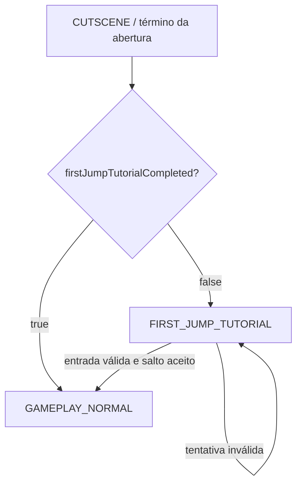

# Tutorial do primeiro salto — guia técnico


## Quando ocorre e quais estados utiliza

`gameplayState` começa em `CUTSCENE`. O callback `OpeningSequence.onComplete` chama `enterFirstJumpTutorial()` após a abertura. Se a abertura já estiver concluída e `opening.start()` não iniciar uma cena, `start()` prepara o gameplay e chama a mesma função. Uma campanha restaurada conserva seu estado salvo, sem reinicializar esse fluxo.



### Fluxograma textual

```text
CUTSCENE
↓
FIRST_JUMP_TUTORIAL
↓
Primeiro salto válido
  Touch: toque primário na tela
  ou Teclado: Espaço
  ou Mouse: clique esquerdo
  ou Gamepad: nova pressão do botão A
↓
GAMEPLAY_NORMAL
```

O fluxo acima corresponde a uma campanha com `firstJumpTutorialCompleted = false`. Se a flag já for verdadeira, o encaminhamento após a abertura vai diretamente para `GAMEPLAY_NORMAL`. “Válido” significa que a entrada passou pelos filtros e o salto foi aceito; receber um evento não basta para concluir.

| Estado | Comportamento |
| --- | --- |
| `CUTSCENE` | Abertura conduzida por `OpeningSequence`; estado inicial dos defaults. |
| `FIRST_JUMP_TUTORIAL` | Espera pelo primeiro salto. Menina parada, IA, câmera e progressão sem atualização. Renderização e leitura de entrada continuam. |
| `GAMEPLAY_NORMAL` | Movimento e atualização normais; instrução e seta do primeiro salto não são desenhadas. |

Esses valores não substituem `currentPhaseMode`, os estados narrativos ou `opening.active`. O tutorial de primeiro salto é distinto de `phase3TutorialActive`/`phase3TutorialProgress`, que pertencem à demonstração após o plot twist.

### Contrato de `CUTSCENE`

- **Objetivo:** representar o estágio inicial da campanha, associado à apresentação da abertura.
- **Entrada:** criação do estado pelos defaults ou reinicialização por `newCampaign()`. A restauração também pode recuperar esse estado e a abertura salva.
- **Saída:** `OpeningSequence.onComplete` chama `enterFirstJumpTutorial()`. Quando a abertura já foi concluída, `start()` pode preparar o gameplay e chamar essa função sem reproduzi-la.
- **Transições permitidas:** para `FIRST_JUMP_TUTORIAL` se `firstJumpTutorialCompleted` for `false`; diretamente para `GAMEPLAY_NORMAL` se for `true`.

`CUTSCENE` não significa que qualquer cutscene futura escreve esse valor: as cenas posteriores usam seus próprios campos narrativos. Antes de `start()`, a campanha pode estar nesse estado sem a abertura estar ativa.

### Contrato de `FIRST_JUMP_TUTORIAL`

- **Objetivo:** permitir que o jogador reconheça a entrada e o destino do primeiro salto, sem avanço automático.
- **Entrada:** `enterFirstJumpTutorial()` após a abertura, com conclusão ainda falsa, ou restauração de um save que aguardava esse salto. A entrada normal bloqueia `baby.controlsLocked` e limpa o aviso genérico.
- **Saída:** somente um salto aceito por `doJump(inputSource)`, originado de toque primário, clique esquerdo, Espaço ou nova pressão de A. A conclusão libera controles, define a flag como verdadeira, atualiza `lastTime` e salva o progresso.
- **Transições permitidas:** para `GAMEPLAY_NORMAL` após esse salto. Tentativas rejeitadas mantêm o estado; pausa, tempo decorrido ou animação visual não o encerram.

Durante a espera, `update` retorna antes de avançar a simulação. Renderização, instrução, ícone, seta e leitura de entrada permanecem ativos. Não existe transição automática por timeout.

### Contrato de `GAMEPLAY_NORMAL`

- **Objetivo:** permitir a atualização e o movimento normais, sem a sobreposição do primeiro salto.
- **Entrada:** conclusão válida do tutorial, desvio de um tutorial já concluído ou restauração/migração de um save de gameplay iniciado.
- **Saída:** não há retorno automático ao tutorial na mesma campanha. `newCampaign()` reinicializa o estado para `CUTSCENE` e a flag para `false`.
- **Transições permitidas:** permanecer em `GAMEPLAY_NORMAL` durante o gameplay e suas cenas narrativas; voltar a `CUTSCENE` por reinicialização explícita de campanha. Retry preserva a conclusão do tutorial.

O nome não remove os bloqueios de pausa, narrativa, derrota ou transição de fase: cada um continua sendo tratado pelos sistemas existentes.

### Matriz de transições

| Origem | Destino | Condição / responsável |
| --- | --- | --- |
| `CUTSCENE` | `FIRST_JUMP_TUTORIAL` | Encaminhamento após a abertura, flag falsa; `enterFirstJumpTutorial`. |
| `CUTSCENE` | `GAMEPLAY_NORMAL` | Encaminhamento após a abertura, flag verdadeira; `enterFirstJumpTutorial`. |
| `FIRST_JUMP_TUTORIAL` | `GAMEPLAY_NORMAL` | Primeiro salto aceito; `doJump(inputSource)`. |
| Qualquer estado | `CUTSCENE` | Nova campanha; `newCampaign` restaura defaults. É reinicialização, não avanço narrativo. |
| Qualquer estado em memória | Estado válido do save | `restoreProgress` restaura a campanha; não constitui conclusão de tutorial. |

Não há transição normal `GAMEPLAY_NORMAL → FIRST_JUMP_TUTORIAL` nem `FIRST_JUMP_TUTORIAL → CUTSCENE` por entrada de salto. A implementação usa strings e condicionais, não uma máquina de estados que impeça toda atribuição arbitrária; esta matriz documenta o fluxo suportado, não uma validação adicional em runtime.

## Fluxo e responsabilidades

| Arquivo / ponto | Responsabilidade |
| --- | --- |
| [game.js](../src/js/game.js): `enterFirstJumpTutorial` | Consulta conclusão, seleciona estado, bloqueia controles e limpa o aviso genérico. Não zera velocidades nem modifica física. |
| `game.js`: `update` | Retorna antes de avançar o tick e os sistemas enquanto o tutorial está ativo. A parada é obtida suspendendo a simulação. |
| `game.js`: `doJump(inputSource)` | Valida origem e condições do salto; aplica o impulso existente. Somente depois de aceitá-lo libera controles, marca conclusão, muda o estado, renova `lastTime` e chama `saveProgress`. |
| `game.js`: `isFirstJumpTutorial()` | Consulta fornecida à API de entrada utilizada pelo controller; retorna se o estado é `FIRST_JUMP_TUTORIAL`. |
| [InputController](../src/js/controllers/InputController.js) | Filtra ponteiros, teclado e bordas do gamepad; encaminha a origem para `doJump`. |
| [BabyRenderer](../src/js/entities/BabyRenderer.js): `resolveAnimationState` | Durante a espera seleciona `idle`, frame 0. |
| [FirstJumpTutorial](../src/js/ui/FirstJumpTutorial.js) | Detecta instrução, calcula feedback e desenha painel compacto, ícone e seta; não escreve na simulação. Exportado também por `ui/index.js`. |
| [StateVariables](../src/js/state/StateVariables.js) / [CampaignProgress](../src/js/state/CampaignProgress.js) | Defaults, captura, restauração e migração dos campos persistentes. |

O bloqueio `baby.controlsLocked` é excepcionalmente permitido em `doJump` para aceitar o salto do próprio tutorial. Outros bloqueios e as verificações de solo/impulso continuam válidos. Não usar `isGrounded()` isoladamente para concluir que o tutorial não pode saltar: essa consulta normal considera controles bloqueados; o controller delega a validação final a `doJump` nesse estado.

## Campos persistentes e transitórios

### Variáveis adicionadas ao sistema

Os quatro campos abaixo foram adicionados ao estado da campanha ou à instância do controller. Variáveis locais usadas para calcular o desenho não são campos de estado.

| Variável | Tipo | Descrição | Valor inicial | Após o tutorial |
| --- | --- | --- | --- | --- |
| `state.firstJumpTutorialCompleted` | `boolean` | Indica se o jogador já completou o tutorial do primeiro salto. Persistente por campanha salva. | `false` | `true`, somente após um salto aceito. |
| `state.gameplayState` | `string` | Identifica o estágio do fluxo inicial. Valores suportados: `CUTSCENE`, `FIRST_JUMP_TUTORIAL`, `GAMEPLAY_NORMAL`. Persistente. | `'CUTSCENE'` | `'GAMEPLAY_NORMAL'`; durante a espera, `'FIRST_JUMP_TUTORIAL'`. |
| `InputController.promptDevice` | `null` ou `string` | Guarda a entrada observada para selecionar mensagem e ícone. Valores: `touch`, `mouse`, `keyboard`, `gamepad`. Transitório; não é salvo. | `null` | Mantém a última entrada observada; não é limpo ao concluir. |
| `InputController.prevTutorialButtonA` | `Map<number, boolean>` | Guarda por índice de gamepad o estado anterior de A, permitindo detectar uma nova pressão. Transitório; não é salvo. | `new Map()` vazio | Continua acompanhando A no polling; entradas são removidas ao desconectar e o mapa é limpo ao destruir o controller. |

`newCampaign()` restaura os dois campos persistentes aos defaults. Os campos do controller seguem seu ciclo de vida próprio; não são reinicializados pela flag de conclusão.

### Parâmetros adicionados às funções

| Parâmetro | Tipo | Descrição / default | Após o tutorial |
| --- | --- | --- | --- |
| `doJump(inputSource)` | `string` ou `undefined` | Origem encaminhada pelo controller: `touch`, `mouse`, `keyboard`, `gamepad`. Sem argumento, é `undefined` e não conclui o tutorial. | Continua identificando a origem da chamada; não é persistido. |
| `timeMs` em `renderFirstJumpTutorial` | `number` | Tempo visual em milissegundos; default `performance.now()` ou `0` quando indisponível. Alimenta `getFirstJumpFeedback`. | A sobreposição não é desenhada fora do tutorial. |
| `reducedMotion` em `renderFirstJumpTutorial` | `boolean` | Preferência por movimento reduzido; default obtido de `prefers-reduced-motion: reduce`, ou `false`. | Não modifica a conclusão nem o gameplay. |

Esses parâmetros e os resultados calculados `scale`, `glow` e `bob` não possuem um valor permanente “após tutorial”: são dados de chamada e desenho. `baby.controlsLocked`, `lastTime`, `uiFeedback` e `lastUsedInputDevice` já existiam; foram utilizados pelo fluxo, não criados por ele.

### Correspondência com nomes conceituais

| Nome sugerido | Implementação real | Contrato |
| --- | --- | --- |
| `showJumpTutorial` | Condição em `renderFirstJumpTutorial` | Não existe como variável. A sobreposição é desenhada somente se `state.gameplayState === 'FIRST_JUMP_TUTORIAL'` e houver plataforma. |
| `tutorialArrowVisible` | Mesma condição do renderer | Não existe como flag independente. Seta e prompt compartilham a visibilidade e desaparecem ao concluir. |
| `currentInputMethod` | `InputController.promptDevice` e `getFirstJumpTutorialDevice` | Não existe com esse nome. O campo registra a entrada observada; a função resolve a instrução com os fallbacks disponíveis. |
| `isInFirstJumpTutorial` | `InputController.game.isFirstJumpTutorial()` | Não existe com esse nome nem como boolean salvo. A consulta retorna a comparação com `FIRST_JUMP_TUTORIAL`. |

Evitar criar flags paralelas apenas para representar essas condições: elas poderiam divergir do estado principal. Os nomes conceituais desta tabela não são APIs utilizáveis.

| Campo | Default / duração | Contrato |
| --- | --- | --- |
| `state.gameplayState` | `CUTSCENE`; persistente | Seleciona os três estados acima. Não duplicado em variável local do coordenador. |
| `state.firstJumpTutorialCompleted` | `false`; persistente | Conclusão única por campanha salva. Só se torna verdadeira após salto aceito. |
| `baby.controlsLocked` | Campo existente | Bloqueado na espera e liberado ao concluir ou ignorar o tutorial já concluído. |
| `InputController.promptDevice` | `null`; transitório | Última entrada observada: `touch`, `mouse`, `keyboard`, `gamepad`. Distingue mouse de teclado para a instrução. |
| `InputController.prevTutorialButtonA` | `Map` vazio; transitório | Estado anterior de A por índice de controle. Atualizado também fora do tutorial; limpo ao desconectar/destruir. |
| `timeMs`, `reducedMotion` | Parâmetros de renderização | Relógio visual e preferência de movimento reduzido; não são flags de campanha. |

A chave de armazenamento continua `legendGirl.campaign.v1`, versão 1. `captureState` inclui ambos os campos novos porque estão nos defaults e não na lista de exclusão. Na leitura de saves antigos sem `gameplayState`, uma abertura ativa e ainda não concluída recebe `CUTSCENE`; as demais campanhas legadas recebem `GAMEPLAY_NORMAL` para preservar o progresso já iniciado. Sem a flag, a migração assume conclusão somente se o estado for `GAMEPLAY_NORMAL`. Um save que já aguardava `FIRST_JUMP_TUTORIAL` continua incompleto. Quando a abertura está explicitamente ativa e não concluída, a leitura normaliza o estado para `CUTSCENE` e a conclusão para `false`, recuperando também saves gravados pela migração anterior com esses campos incorretos.

Retry e restauração preservam a conclusão. `newCampaign` restaura defaults e permite o tutorial novamente. Não confundir conclusão da abertura com conclusão do primeiro salto. Se o storage falhar, a campanha pode continuar em memória da sessão; isso não garante persistência após fechar/recarregar a página.

### Contrato de persistência

| Campo | Salvo | Restaurado | Impacto |
| --- | --- | --- | --- |
| `firstJumpTutorialCompleted` | Sim, no estado da campanha; gravação solicitada imediatamente após salto aceito. | Sim. | Impede repetição do tutorial no mesmo save; campanha nova volta a `false`. |
| `gameplayState` | Sim. | Sim, com validação dos três valores suportados. | Permite retomar a espera pelo primeiro salto ou o gameplay já iniciado. |
| `promptDevice` | Não. | Não pelo save. | A instrução depende das entradas e capacidades disponíveis na sessão atual. |
| `prevTutorialButtonA` | Não. | Não pelo save. | A borda de pressão é rastreada pelo controller ativo. |
| Visibilidade de prompt, seta e ícone | Não como flags separadas. | Derivada do estado restaurado. | Evita reexibir elementos após conclusão. |

## Entradas que podem concluir

| Entrada | Evento aceito no tutorial | Instrução / ícone |
| --- | --- | --- |
| Smartphone touch | `pointerdown` primário | TOQUE NA TELA PARA PULAR / dedo tocando |
| Desktop teclado | Espaço (`code: Space` ou `key: ' '`) sem repetição | PRESSIONE ESPAÇO / tecla Espaço |
| Desktop mouse | Clique esquerdo primário | CLIQUE COM O MOUSE / mouse com clique destacado |
| Xbox / gamepad compatível | Nova pressão do botão A, índice 0; `pressed` ou `value > 0.5` | PRESSIONE A / círculo verde com A |

Uma origem reconhecida é necessária, mas não suficiente: pausa, ausência de solo, debounce e demais bloqueios do salto podem rejeitar a tentativa. Cliques na barra superior ou em overlays ativos não saltam. Seta para cima e X não confirmam o tutorial. A já segurado antes da entrada não confirma automaticamente; é necessário soltar e pressionar novamente.

Após o tutorial, os mapeamentos existentes continuam: Espaço/seta para cima e botão X (índice 2). Não expandir silenciosamente o mapeamento A para o gameplay normal. Chamadas diretas a `doJump()` sem origem não concluem a espera.

`getFirstJumpTutorialDevice({device, nav, coarse})` considera entrada observada, conexão via `getGamepads` e fallback móvel/ponteiro coarse. Uma entrada explícita touch/mouse/teclado prevalece; `gamepad` explícito exige conexão. Sem entrada observada, um gamepad conectado é preferido, seguido de touch ou teclado. A função não identifica fabricante: a indicação Xbox utiliza o mapeamento esperado, não uma certificação de hardware.

## Apresentação e coordenadas

### Elementos visuais adicionados

| Elemento | Objetivo | Visibilidade |
| --- | --- | --- |
| Tutorial Arrow — seta | Apontar para a primeira plataforma, flutuando acima do apoio, sem linha sobre sua superfície. | Somente em `FIRST_JUMP_TUTORIAL`, quando a plataforma está disponível. |
| Tutorial Prompt — instrução | Mostrar a ação de pulo adequada à entrada ativa: toque, Espaço, clique ou A. | Mesma condição da seta; não é modal. |
| Ícone de entrada | Reforçar a instrução com dedo, tecla Espaço, mouse ou A verde. | Junto ao prompt; varia com o dispositivo resolvido. |
| Escala, brilho e flutuação | Chamar atenção de forma suave para a instrução e o destino. | Durante o desenho do tutorial; animação fica estável com movimento reduzido. |

A mensagem deve acompanhar a entrada ativa, inclusive em dispositivos híbridos. Não fixar o texto apenas pelo sistema operacional: mouse e teclado possuem instruções diferentes, e um gamepad conectado pode ser utilizado no mesmo dispositivo. Consulte a tabela de entradas e a precedência de detecção acima.

`renderFirstJumpTutorial(ctx, canvas, options)` recebe estado, menina, fadinha, `platforms[0]`, `cameraX`, matriz real de apresentação e dispositivo. Retorna `null` fora do tutorial ou sem plataforma; durante o desenho retorna dispositivo, texto, caixa, projeções, feedback e ícone para inspeção.

A projeção usa a matriz da cena e `x - cameraX` uma única vez. O destino é o centro de `standRegion` (ou plataforma), com `surfaceTopY` quando disponível. O contexto é restaurado para coordenadas de tela antes da sobreposição. O painel usa área segura e proporção bitmap/CSS, buscando ficar acima da menina, fadinha e destino. A seta flutua acima do apoio, sem traços sobre a superfície ilustrada.

O desenho ocorre depois de `ArtFinish` e HUD e antes dos diálogos. Não cria DOM modal, tela adicional ou pausa global. `getFirstJumpFeedback(timeMs, reducedMotion)` utiliza ciclo senoidal de 1.600 ms: escala 0,96–1,04, brilho 0,12–0,20 e deslocamento vertical ±3 unidades antes da escala de apresentação. O relógio padrão é `performance.now()`, independente do tick congelado. Com `prefers-reduced-motion: reduce`, a onda é zero e a apresentação fica estável.

## Validação e reprodução

Executar na raiz:

```sh
node scripts/test-first-jump-prompt.js
node scripts/test-campaign-progress.js
node scripts/test-opening-sequence.js
```

`npm test` inclui a verificação unitária do prompt e da campanha. `npm run test:tutorial:browser` executa os quatro testes de navegador abaixo.

Para testes de navegador, manter servidor local em `127.0.0.1:3000` e Chrome dedicado com CDP em `127.0.0.1:9222`. As fixtures instrumentadas ficam em `tests/`; suas APIs manuais não pertencem ao jogo distribuído.

```sh
node scripts/test-first-jump-tutorial-browser.js
node scripts/test-first-jump-prompt-browser.js
node scripts/test-first-jump-completion-browser.js
node scripts/test-first-jump-production-browser.js
```

| Teste | Cobertura |
| --- | --- |
| `test-first-jump-tutorial-browser.js` | Abertura completa, entrada no estado e 600 frames sem movimento, avanço ou câmera. |
| `test-first-jump-prompt.js` | Detecção/troca/desconexão, layout, ausência de mutações, pulsação e movimento reduzido. |
| `test-first-jump-prompt-browser.js` | Quatro instruções, capturas e amostras temporais com simulação parada. Pausa explícita da fixture evita consumir o tutorial ao inspecionar entradas. |
| `test-first-jump-production-browser.js` | Página real, botão de início/continuação, abertura completa, saves legados, restauração e entradas CDP em Android/iPhone emulados e desktop. |
| `test-first-jump-completion-browser.js` | Entradas válidas/inválidas, A segurado, impulso original, retomada, ocultação, save, retry, restauração e campanha nova. |

As evidências ficam em `assets/qa-testers/current-logs/first-jump-*.json`, `current-screenshots/first-jump-tutorial/` e no relatório vinculado no início. Os cenários de touch e gamepad são sintéticos no Chrome; não comprovam execução em dispositivos físicos. A compreensão sem documentação requer observação de jogadores, além da revisão das capturas.

Checklist manual: assistir à abertura, aguardar sem entrada, conferir menina/câmera paradas e renderização animada, executar uma entrada válida, conferir retomada e ocultação, repetir no mesmo save e iniciar campanha nova. Revisar retrato/paisagem, áreas seguras, troca de dispositivo, desconexão do controle, movimento reduzido, pausa e recarga. Não substituir esse checklist por chamadas artificiais que marquem a flag diretamente.

## Como evoluir com segurança

1. Manter separadas a validação do salto, a persistência e a renderização. Não marcar conclusão em um handler antes da aceitação física.
2. Novos dispositivos devem atualizar detecção, instrução, ícone, evento e testes em conjunto; preservar bordas de botão, repetição e filtragem de UI.
3. Novos tutoriais precisam de estados/flags próprios e migração explícita. Não reutilizar `firstJumpTutorialCompleted` ou os campos da terceira parte para outra finalidade.
4. Preservar o impulso original, física, colisões, velocidades, layout e dificuldade. Alterações visuais não devem mover câmera ou personagem para compensar a posição do painel.
5. Manter animação no relógio visual, preferências de acessibilidade e equilíbrio de `save`/`restore`. Revisar matrizes para evitar zoom ou offsets aplicados duas vezes.
6. Revisar captura/restauração e saves legados ao mudar contratos; testar storage indisponível. Atualizar este guia, manual, referência e evidências quando o sistema mudar.

Limite atual: há uma única instrução para `platforms[0]`, com rótulos fixos em português. Generalizar a sequência ou localizar textos exige uma mudança futura explícita, com testes de estados e persistência. Este documento não implementa essa evolução.
