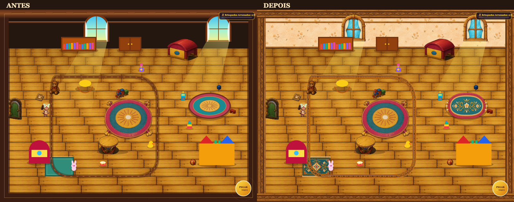

# Toy Room — Etapa 1 da refatoração visual

Data: 5 de outubro de 2026.

Implementação concluída e validada localmente, disponível para revisão artística. A próxima etapa não foi iniciada. As notas abaixo são a avaliação visual da implementação, sujeita à aprovação do usuário.

## Resultado artístico

A faixa preta foi substituída por papel de parede ilustrado em creme e pêssego, com textura e flores discretas. As janelas receberam molduras de madeira pintada e cortinas com trama e dobras. Rodapés e frisos usam madeira com veios e entalhes. Os tapetes secundários compartilham a paleta e o acabamento têxtil do tapete central, com ornamentação própria. O circuito ganhou peças de madeira, dormentes e encaixes.

A referência artística foi `assets/art/toy-room/environment-sheet.png`: tapete central, baú, mesa, urso, trem, porta e piso. Esses assets foram preservados.

| Item | Antes | Depois | Evidência da melhoria |
|---|:---:|:---:|---|
| Parede superior | E | B | Papel de parede com textura suave; ausência da faixa preta. |
| Janelas | D | B | Molduras pintadas, bevels, veios e profundidade; dois recortes nos mesmos destinos de 160 × 170. |
| Cortinas | D | B | Tecido claro com trama, dobras, amarrações e volume, dentro das janelas. |
| Rodapés | C | B | Material de madeira pintada, integrado à junção entre parede e piso. |
| Frisos | C | B | Madeira texturizada e entalhes discretos nas bordas arquitetônicas. |
| Tapete oval | D | B | Trama, bordas costuradas, franjas e bordado floral próprio. |
| Tapete retangular | D | B | Trama, bordas, franjas e bordado de losangos e flores. |
| Circuito de trilhos | D | B | Trilhos de madeira com dormentes e encaixes; continuidade visual nas curvas. |

Legenda: A — Excelente; B — Bom; C — Aceitável; D — Precisa revisão; E — Fora do padrão.

## Comparação antes/depois

- [Antes — sala inteira](antes.png)
- [Depois — sala inteira](depois.png)
- [Desktop — entrada](desktop-entrada.png)
- [Desktop — região superior direita](desktop-superior-direita.png)
- [Desktop — região inferior](desktop-inferior.png)
- [Viewport móvel em paisagem, 915 × 412](android-paisagem.png)
- [Viewport móvel em retrato, 390 × 844](celular-retrato.png)

As capturas completas usam um enquadramento de auditoria de 1600 × 1200. As demais usam os renderizadores e o enquadramento da fase em tamanhos menores. As capturas móveis são emulações de viewport no Chrome de desktop, sem representar testes em hardware Android ou iPhone.

## Integrações incrementais

Cada integração foi seguida por inspeção visual, comparação com a referência, validação de gameplay e medição do fundo. `npm test` passou após cada integração.

| Integração | Captura | Registro técnico |
|---|---|---|
| Parede | [01-parede.png](01-parede.png) | [Validação](01-parede-validacao.json) |
| Janelas e cortinas, no mesmo recorte | [02-janelas-cortinas.png](02-janelas-cortinas.png) | [Validação](02-janelas-cortinas-validacao.json) |
| Rodapés e frisos | [03-rodapes-frisos.png](03-rodapes-frisos.png) | [Validação](03-rodapes-frisos-validacao.json) |
| Tapete oval | [04-tapete-oval.png](04-tapete-oval.png) | [Validação](04-tapete-oval-validacao.json) |
| Tapete retangular | [05-tapete-retangular.png](05-tapete-retangular.png) | [Validação](05-tapete-retangular-validacao.json) |
| Trilhos | [06-trilhos.png](06-trilhos.png) | [Validação](06-trilhos-validacao.json) |

## Preservação de gameplay e escopo

- Mapa preservado: 1600 × 1200.
- Posições das janelas preservadas: (520, 30) e (1280, 30), ambas desenhadas em 160 × 170.
- Tapete oval: mesmo centro e limites visuais da borda anterior, 263 × 163; sombra anterior preservada separadamente.
- Tapete retangular: mesma posição, corpo de 180 × 120 e extensão original de seis pixels para as franjas nas duas bordas; sombra anterior preservada.
- Circuito: mesmos pontos, curvas e largura de 24 pixels. As peças ilustradas são recortadas pela faixa original. A montagem não participa de colisões ou navegação.
- Gameplay, coleta, objetivos, física, tamanho do mapa e lógica da fase não foram editados.
- Móveis, brinquedos, personagem, fada, interface e efeitos não foram editados.
- Feixes solares e sombras existentes foram preservados; `LightingSystem.js` permaneceu intacto.
- O desenho do piso, da porta, do tapete central e dos móveis foi comparado por igualdade dos métodos de renderização.
- O teste confere hashes dos arquivos fora do escopo contra a referência anterior à implementação.

A comparação da sala completa encontrou **657.937 pixels alterados e zero pixels alterados fora das áreas ambientais autorizadas**. A máscara considera a área real do friso anterior: o traço em 58 pixels, com espessura de cinco pixels, chegava a 60,5 pixels. [Registro da comparação](comparacao-pixels.json).

## Validação funcional

- 4.941 amostras de limites da sala.
- 35 amostras específicas ao redor e dentro dos sete obstáculos, comparadas à referência.
- Movimento nas quatro direções.
- Coleta e soltura de cada um dos oito brinquedos.
- Armazenamento dos oito brinquedos e ativação do objetivo final.
- Renderização sem alteração do estado da fase.
- Carregamento de todos os recursos registrados.
- `npm test`, `npm run lint`, `npm run check-assets` e a validação visual no navegador aprovados.

Evidências: [validação final](depois-validacao.json), [log dos testes finais](testes-finais.log), [referência de gameplay](gameplay-referencia.json) e [integridade dos arquivos preservados](integridade-referencia.json).

Ocorreram duas falhas intermitentes de carregamento durante a validação com o servidor temporário Python: uma em um SVG existente e outra no PNG dos trilhos. O trabalho foi interrompido para investigar cada falha. Os arquivos foram confirmados íntegros e servidos com HTTP 200. Após substituir o servidor temporário por Express, a execução integral carregou todos os recursos e passou. Não houve alteração do carregador de produção nem do SVG existente. A comparação de pixels também foi interrompida para corrigir a máscara do friso antigo antes de continuar.

## Performance

Medição local em Chrome headless, na mesma sessão, com as versões anterior e atual. A montagem do circuito é feita uma vez por imagem e reutilizada nos quadros seguintes.

| Medição | Antes | Depois |
|---|---:|---:|
| Mediana de renderização completa, 960 × 580 | 0,60 ms | 0,60 ms |
| P90 de renderização completa | 0,80 ms | 0,80 ms |
| Mediana do intervalo entre quadros | 16,70 ms | 16,70 ms |
| Mediana do fundo isolado, 1600 × 1200 | 0,3975 ms | 0,3875 ms |

Não foi detectada regressão de renderização ou cadência nesse ensaio. Isso não estabelece equivalência em todos os dispositivos ou redes. [Medição dos quadros completos](performance-quadros.json).

Os seis PNGs acrescentam aproximadamente 1,4 MiB ao carregamento inicial. O circuito reutilizado ocupa um canvas de 684 × 644, aproximadamente 1,68 MiB de pixels RGBA. Esse custo de transferência e memória é uma consequência da arte raster nova e deve ser considerado na revisão; a medição de quadros não mede carregamento em rede lenta.

## Checklist de aceitação

- [x] Qualidade mínima B nos oito itens, pela avaliação visual desta implementação.
- [x] Nenhum item desta etapa permanece D ou E.
- [x] Maior consistência de materiais, textura e acabamento.
- [x] Nenhuma mecânica ou colisão alterada.
- [x] Posições e áreas de destino preservadas.
- [x] Navegação e objetivo final validados.
- [x] Sem regressão detectada no desempenho local de renderização.
- [x] Sem placeholders ou áreas pretas vazias nos itens corrigidos, com os recursos carregados.
- [x] Todos os testes finais aprovados.
- [ ] Revisão e aprovação do usuário.

## Problemas restantes e próxima etapa

Continuam as diferenças de acabamento dos móveis geométricos, dos seis brinquedos simplificados, da fada e da apresentação dos brinquedos carregados. A perspectiva da protagonista ao caminhar verticalmente também permanece. A iluminação global, as sombras, a interface e os efeitos mantêm as características apontadas na auditoria.

O circuito continua passando sobre parte do tapete retangular, como no layout anterior. As bordas esculpidas têm repetição de motivos; a revisão artística pode avaliar se a ornamentação está suficientemente discreta. Não houve rearranjo da sala para resolver esses pontos.

Recomenda-se avaliar móveis e brinquedos numa próxima etapa separada, usando os mesmos assets de referência e o mesmo controle de geometria. Nenhum trabalho dessa próxima etapa foi iniciado.

## Reprodução e reversibilidade

O teste é `scripts/test-toy-room-visual-browser.js`, acessível por `npm run test:toy-room:visual`. Ele requer um servidor estático local na porta 8765 e um Chrome dedicado com `--remote-debugging-port=9223`. As portas podem ser substituídas por `TOY_REVIEW_HTTP_PORT` e `TOY_REVIEW_CDP_PORT`.

O arquivo `renderer-antes.txt` é uma evidência congelada do renderizador anterior, usada apenas pelo teste comparativo. Os arquivos `*-v1.png` são novos; a prancha original não foi sobrescrita. Os caminhos dos assets e os prompts originais estão em `assets/art/toy-room/stage1/`. A geração usou a ferramenta integrada `image_gen`, sem CLI ou API externa adicional.

Para desfazer a integração visual, basta reverter as alterações do renderizador e os seis registros novos no manifesto. A lógica da fase não precisa de restauração.
