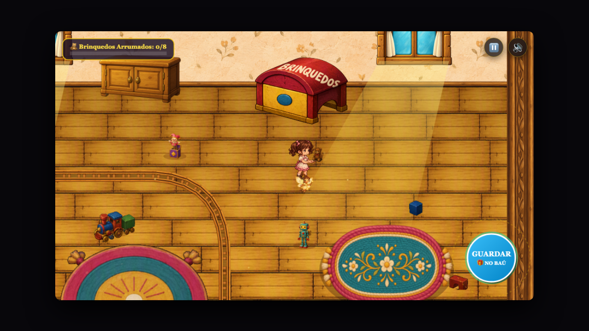
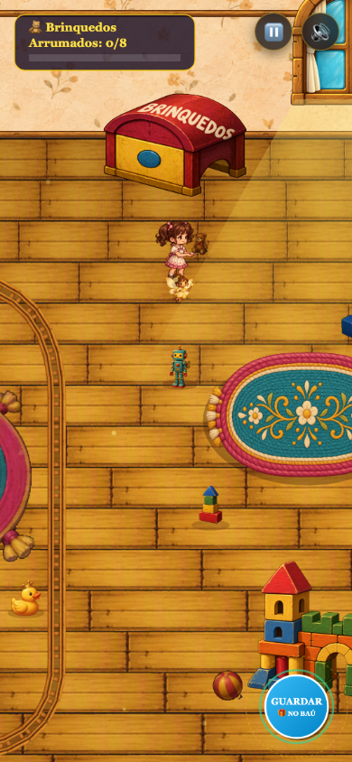
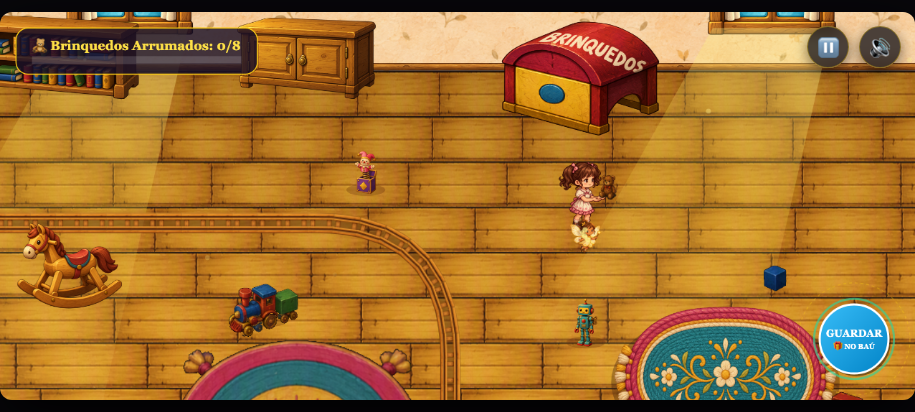

# Toy Room — identificação integrada à caixa

Validação realizada em 07/10/2026.

A identificação foi incorporada à textura da tampa vermelha: **BRINQUEDOS**, em letras creme com aparência de pintura sobre madeira. A inscrição acompanha a curvatura, a perspectiva e o sombreamento do móvel. Não existe uma camada de texto de interface na renderização normal.

O [sprite final](../../../assets/art/toy-room/chest-brinquedos-v1.png) foi produzido com a ferramenta integrada `image_gen`, seguindo a skill `imagegen`, a partir do [recorte original](caixa-original.png). O [registro da geração](geracao.json) contém o prompt efetivamente utilizado. O atlas original permaneceu intacto; somente a caixa utiliza o novo recurso registrado no manifesto.

O sprite continua ocupando o retângulo visual anterior: `x - 4`, `y - 10`, `w + 8`, `h + 22`. As coordenadas e dimensões físicas da caixa continuam sendo `x: 1040`, `y: 190`, `w: 190`, `h: 115`. A inscrição é parte dos pixels do PNG, com fundo transparente, e participa da mesma ordenação por profundidade dos móveis. Não há reposicionamento para acompanhar a câmera ou permanecer na tela quando o móvel sai do enquadramento.

## Capturas e legibilidade

Capturas do aplicativo real em Chrome, com a apresentação móvel existente e sem alterar câmera ou escala de produção. A aproximação da protagonista foi montada pelo teste para inspecionar o móvel. A transição existente do panorama de entrada foi aguardada antes das capturas de gameplay.

| Formato | Resolução da janela | Captura | Resultado da inspeção |
| --- | --- | --- | --- |
| Desktop | 1280 × 720 | [Caixa no gameplay](desktop-caixa.png) | Palavra legível, pintura integrada à tampa, separada do HUD e dos personagens. |
| Mobile retrato | 390 × 844 | [Caixa no gameplay](mobile-retrato-caixa.png) | Palavra completa, sem corte, sem sobreposição com HUD, protagonista ou fadinha. |
| Mobile paisagem | 915 × 412 | [Caixa no gameplay](mobile-paisagem-caixa.png) | Palavra completa e legível, mantendo perspectiva e proporção do móvel. |
| Mobile retrato reduzido | 320 × 568 | [Caixa no gameplay](mobile-retrato-320-caixa.png) | Inscrição reconhecível e completa, sem ampliar artificialmente o objeto ou o texto. |







O [recorte de resolução de gameplay](caixa-resolucao-gameplay.png), com 198 × 137 pixels, mostra a inscrição no tamanho lógico em que o móvel é desenhado antes da apresentação responsiva. As capturas completas acima são a evidência da legibilidade efetiva em tela; o recorte não substitui essa verificação.

O panorama da cinematica de entrada foi preservado. Nesse panorama, o texto diminui junto com o móvel; a aprovação de legibilidade considera o enquadramento jogável após essa transição.

## Remoção do marcador flutuante

Removidos a função `renderChestLabel`, seu import e sua chamada no controlador da sala. Foram eliminados o texto `CAIXA DE BRINQUEDOS`, o retângulo flutuante, a seta permanente, a busca de espaço livre na tela e o posicionamento preso à câmera. Os testes da guia foram mantidos e deixaram de verificar o marcador descartado.

Na ausência do PNG, a versão procedural já existente também usa somente `BRINQUEDOS`, pintado dentro da tampa e acompanhando sua abertura. O antigo texto sobre o baú foi retirado desse fallback. Não foi criado um novo tutorial ou elemento de HUD.

## Gameplay e integridade

O teste de navegador executou os seguintes cenários nos quatro formatos da tabela:

- Entrada pela introdução real da Toy Room, mantendo o tutorial ativo.
- Movimento que avança o tutorial para coleta.
- Coleta pela ação existente, encerrando o tutorial como antes.
- Armazenamento pela ação existente: contador passa a `1/8`, item deixa de ser carregado.
- Coleta e armazenamento dos oito brinquedos: contador `8/8` e faixa de conclusão existente.
- Renderização sem qualquer mutação do snapshot da fase.

Capturas adicionais: [entrada desktop](desktop-entrada.png), [tutorial desktop](desktop-tutorial.png), [armazenamento em retrato](mobile-retrato-armazenamento.png), [conclusão desktop](desktop-conclusao.png), [conclusão em retrato](mobile-retrato-conclusao.png) e [conclusão em paisagem](mobile-paisagem-conclusao.png). Todos os arquivos dos quatro formatos estão nesta pasta.

O [resultado do navegador](navegador.json) registra quatro execuções aprovadas, nenhuma exceção, dimensões do sprite, câmera, estado de coleta, armazenamento e vitória. O teste posiciona a protagonista para alcançar cada objeto; essa montagem pertence exclusivamente à validação, sem mudanças nas posições de produção.

O [resultado de escopo](escopo.json) confirma que `triggerAction`, `resolveCollisions`, `update`, `snapshot`, `restore` e `startTutorial` permanecem idênticos à versão existente no início desta tarefa. Os móveis, brinquedos e snapshot inicial também são idênticos. Assim, a orientação da fadinha da tarefa anterior foi preservada integralmente.

O [teste de integridade](integridade.json) aprovou 4.941 amostras de colisão, 960 quadros de movimento, oito coletas, oito solturas e oito armazenamentos comparados à referência existente do projeto.

Verificações adicionais aprovadas: `npm test`, `npm run check-assets` (87 recursos), teste da guia, teste do tutorial e controles de gamepad, além de `git diff --check`. Nenhuma dependência foi adicionada.

## Resultado visual

**Aprovado na inspeção das capturas.** A caixa conserva sua aparência de móvel de madeira com tampa vermelha, frente amarela e fecho azul. A palavra acompanha a superfície física, identifica seu uso e permanece dentro da silhueta do objeto. Não há placa pairando no ar, tooltip, seta ou marcador de objetivo. A identificação permanece no móvel durante armazenamento e conclusão, sem competir com a interface ou mudar a celebração existente.

Para repetir as verificações, iniciar `PORT=3001 node server.js` e um Chrome de testes com CDP em `9222`, então executar:

```sh
node scripts/test-toy-room-identification-browser.js
node scripts/test-toy-room-identification.js
TOY_INTEGRITY_EVIDENCE=docs/qa/toy-room-identificacao node scripts/test-toy-room-tutorial-integrity.js
node scripts/test-toy-room-orientation.js
node scripts/test-toy-room-tutorial.js
npm test
npm run check-assets
```

As portas do teste de navegador podem ser ajustadas por `TOY_REVIEW_HTTP_PORT` e `TOY_REVIEW_CDP_PORT`.
