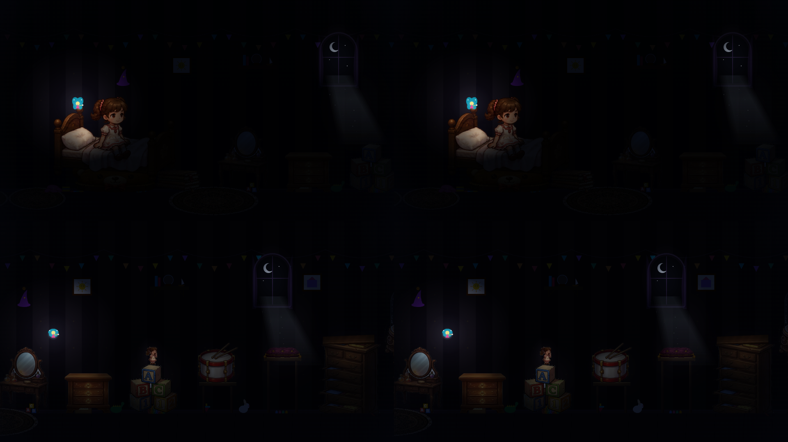
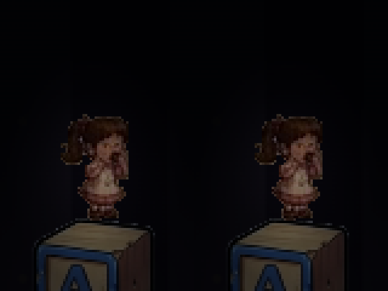

# QA-003 — Coesão do acabamento visual

## Ajustes aplicados

- `src/js/effects/ArtFinish.js`: redução suave de saturação por composição `saturation`, com opacidade 0,12 e cinza neutro. O mesmo passe trata móveis, brinquedos, personagem e fada, após a iluminação e antes da interface, tanto na abertura quanto na fase. Não adiciona luz, textura, desfoque geral ou contornos. A operação preserva a luminosidade segundo a composição do Canvas; pequenas diferenças de arredondamento de canais são possíveis.
- `src/js/entities/BabyRenderer.js`: amostragem suavizada em qualidade alta ao redimensionar os recortes originais. Reduz a dureza das bordas sem mudar o desenho, escala, ancoragem dos pés, seleção de quadros ou duração das animações.
- `src/js/game.js` e `src/js/cinematics/OpeningSequence.js`: aplicação do acabamento comum antes de HUD, diálogos e transições. A sala de brinquedos independente não recebeu pós-processamento.

## Comparativo

Abertura aos 31 segundos na primeira linha; fase nos Blocos ABC na segunda. As capturas integrais incluem também a abertura aos 5 e 34 segundos e a Cômoda. Nenhuma correção de exposição foi aplicada às evidências.

Ampliação por vizinho mais próximo somente na apresentação da evidência, para inspecionar os pixels da captura. O jogo usa a suavização descrita acima.

## Validação

- Inspeção visual: cores mais contidas, bordas da personagem menos duras e acabamento mais próximo entre as duas cenas, com penumbra preservada. A mudança é intencionalmente discreta.
- Personagem idêntica em desenho e origem: teste oficial confirmou 52.406 pixels opacos iguais à fonte e os mesmos recortes para todas as poses. Os pixels finais exibidos mudam com a amostragem e a saturação permitidas pelo escopo.
- Todos os 92 arquivos rastreados em `assets` e `src/assets` foram comparados byte a byte com HEAD e continuam idênticos. Manifesto SHA-256 em `assets-verificados.json`. Nenhum asset de produção foi gerado ou substituído; os PNGs desta pasta são evidências.
- `npm test`, `node scripts/test-opening-sequence.js` e `node scripts/test-lighting.js`: aprovados. Saída completa em `testes.txt`.
- Playtest automatizado no Chrome: saltos para Blocos ABC e Cômoda em passos de tempo 0,5 / 1 / 1,2. Os seis resultados antes/depois são idênticos, incluindo posição de lançamento, duração e contato.

A abertura mantém sua representação ilustrada original; o tratamento reduz diferenças de acabamento, sem tornar desenhos distintos iguais. Não houve redesenho, alteração de animações, física ou hitboxes.

### Revalidação da entrega — 29/09/2026

A implementação já presente no diretório foi revisada e preservada. `npm test`, `test-opening-sequence.js` e `test-lighting.js` foram executados novamente e aprovados; saída em `revalidacao.txt`. Uma nova comparação byte a byte confirmou os 92 assets rastreados idênticos a HEAD. Os resultados de playtest antes/depois arquivados também são iguais. O comparativo existente foi inspecionado: a aproximação da paleta é discreta, com a penumbra mantida. As capturas e os playtests de navegador não foram refeitos nesta revalidação.

## Reprodução

Servidor estático na porta 3000 e Chrome dedicado com `--remote-debugging-port=9222`. Executar `node scripts/capture-qa003.js antes` na versão anterior e `node scripts/capture-qa003.js depois` na ajustada. A página de revisão expõe `openingFrame` apenas para capturar tempos fixos da abertura.

As capturas da fase usam tick 151 e fada atrás da personagem somente na instrumentação, com os mesmos parâmetros nos dois estados. A mensagem fora do canvas nas capturas integrais é um resíduo da simulação da página de testes. A validação não representa uma sessão manual completa.
